# Tareas   R4DS.

## Visualización de datos con ggplot2.

### Pregunta 1.

**Si ejecutas `ggplot(data = mpg)`, ¿Qué observas?**

#### Solución
Inicializa el gráfico vacío a las espera de otras especificaciones de lo que se tiene que dibujar.

Podemos ver un recuadro vacío, lo que observamos es la base para un gráfico.

```r
ggplot(data = mpg)
```

<!-- -->

### Pregunta 2.

**Indica el número de filas que tiene el data frame `mpg`. ¿Qué significa cada fila?**

#### Solución

Usando el comando nrow() sabemos que tiene 234 filas y observando con el comando View() se deduce que cada fila conforma las especificaciones de cada vehículo.

```r
nrow(mpg)
```

```
## [1] 234
```

### Pregunta 3.

**Indica el número de columnas que tiene el data frame mpg. ¿Qué significa cada columna?**

#### Solución

De la misma manera que con las filas usando el comando ncol() sabemos que el número de columnas es 11 y consultando la información auxiliar con el comando ? entendemos que cada columna refleja una característica.

"manufacturer": marca

"model name": Nombre del modelo

"displ": ciclindrada en litros

"year": año de producción

"cyl": número de cilindros

"trans": tipo de transmisión 

"drw": tipo de tracción (f: delantera,r: trasera, 4: 4 ruedas)

"cty": millas por galón en ciudad

"hwy": millas por galón en autopista

"fl": tipo de combustible

"class": tipo de coche

```r
ncol(mpg)
```

```
## [1] 11
```

### Pregunta 4.

**Observa la variable drv del data frame. ¿Qué describe? Recuerda que puedes usar la instrucción ?mpg para consultarlo directamente en R.**

#### Solución


Como ha sido comentado anteriormente "drv" indica el tipo de tracción del coche.

### Pregunta 5.

**Realiza un scatterplot de la variable hwy vs cyl. ¿Qué observas?**

#### Solución

Podemos ver una gráfica en la que se comparara el número de cilindros y la eficiencia en millas por galón. A primera vista parece indicar que los coches con menos cilindros son más eficientes.


```r
ggplot(data=mpg)+ geom_point(mapping= aes(x=hwy , y=cyl))
```

<!-- -->

### Pregunta 6.

**Realiza un scatterplot de la variable cty vs cyl. ¿Qué observas?**


#### Solución

Vemos una comparativa entre el número de millas por galón en ciudad y el número de cilindros. A primera vista parece indicar que los coches con menos cilindros son mas eficientes

```r
ggplot(data=mpg)+ geom_point(mapping= aes(x= cty , y=cyl))
```

<!-- -->


### Pregunta 7.

**Realiza un scatterplot de la variable class vs drv. ¿Qué observas? ¿Es útil este diagrama? ¿Por qué?**

#### Solución

Observamos una comparativa entre la clase del coche y si tracción. Este diagrama no es útil ya que compara dos variables sin interés ya que nuestro objetivo es estudiar la eficiencia. En general no aporta datos relevantes.

```r
ggplot(data=mpg)+ geom_point(mapping= aes(x=class , y=drv))
```

<!-- -->


## Tarea Estéticas ggplot. 

### Pregunta 1.

**Toma el siguiente fragmento de código y di qué está mal. ¿Por qué no aparecen pintados los puntos de color verde?**


#### Solución


```r
ggplot(data = mpg) +
  geom_point(mapping = aes(x = displ, y = hwy, color = "green"))
```

<!-- -->

Si se desea que los puntos aparezcan de color verde se tiene que escribir el comando de la manera siguiente.

```r
ggplot(data = mpg)+
  geom_point(mapping = aes(x=displ, y = hwy), color="green")
```

<!-- -->

### Pregunta 2.

**Toma el dataset de `mpg` anterior y di qué variables son categóricas.**


#### Solución

Las variables categóricas son el modelo, la marca, la transmisión, la tracción, el tipo de combustible y el tipo de coche ("manufacturer", "model", "trans", "drv", "fl" y "class")

### Pregunta 3.

**Toma el dataset de mpg anterior y di qué variables son continuas. Dibuja las variables continuas con color, tamaño y forma respectivamente.**


#### Solución


Las variables continuas son "displ","cty" y "hwy"


```r
ggplot(data = mpg) +
  geom_point(mapping = aes(x=displ , y = cty , color=displ ))
```

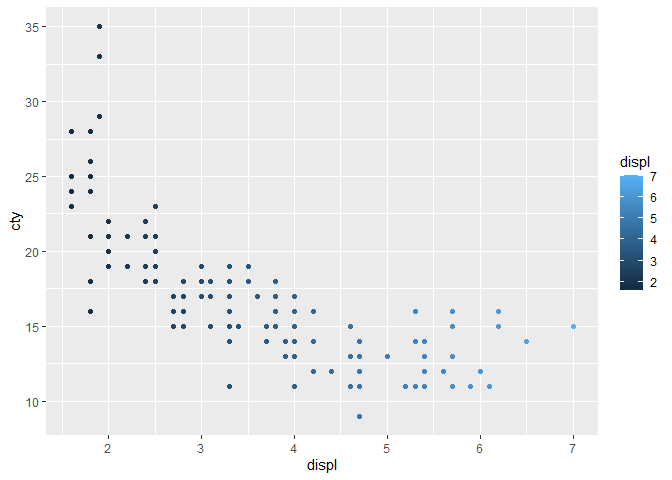<!-- -->

```r
ggplot(data= mpg) +
  geom_point(mapping = aes(x=displ , y= hwy , size=cty))
```

<!-- -->

```r
ggplot(data = mpg) +
  geom_point(mapping = aes(x=displ , y =cty ), shape=22)
```

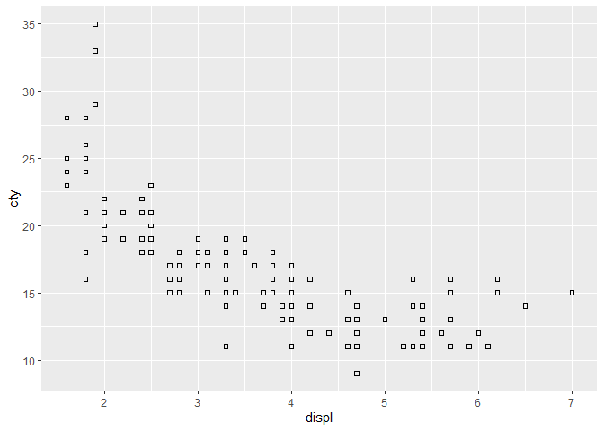<!-- -->

### Pregunt 4.

**¿En qué se diferencian las estéticas para variables continuas y categóricas?**


#### Solución

Las variables categóricas indican la pertenencia a un conjunto (la gente rubia, los hijos de María,...) en cambio las variables continuas indican el valor de una cierta propiedad (tiene una capacidad de 20 litros, una altura de 1.8 metros,...).

### Pregunta 5.

**¿Qué ocurre si haces un mapeo de la misma variable a múltiples estéticas?**


#### Solución

Todas esas estéticas serán usadas conjuntamente.

### Pregunta 6.

**Vamos a conocer una estética nueva llamada `stroke`. ¿Qué hace? ¿Con Qué formas funciona bien? **


#### Solución

La estética 'stroke' permite modificar el grosor del borde de aquellas figuras que lo tengan ('shape' entre 21 y 25).

### Pregunta 7.

**¿Qué ocurre si haces un mapeo de una estética a algo que no sea directamente el nombre de una variable (por ejemplo aes(color = displ < 4))?**


#### Solución


R entiende el criterio como una división y aplica la estética a aquello que cumple la condición impuesta.


```r
ggplot(data = mpg) +
  geom_point(mapping = aes(x= cyl , y = displ ,color = displ < 4))
```

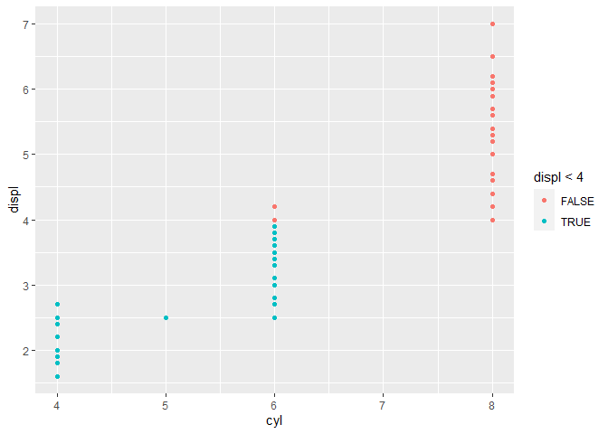<!-- -->


## Tarea:  Subplots con facets. 

### Pregunta 1.
**¿Qué ocurre si hacemos un `facet` de una variable continua?**

#### Solución

Hará tantos cuadros como valores encuentre.

```r
ggplot(data = mpg) +
  geom_point( mapping = aes(x=displ , y = cty )) + facet_wrap(~displ)
```

<!-- -->


### Pregunta 2.
**¿Qué significa si alguna celda queda vacía en el gráfico `facet_grid(drv~cyl)`? ¿Qué relación guardan esos huecos vacíos con el gráfico siguiente?**


#### Solución

Hay huecos vacíos debido a que no hay datos que satisfagan ambas condiciones. La tabla posterior muestra esos vacíos.


```r
ggplot(data = mpg) +
  geom_point(mapping = aes(x= displ , y = cty))+facet_grid(drv~cyl)
```

<!-- -->


```r
ggplot(data = mpg) +
  geom_point(mapping = aes(x=drv, y = cyl))
```

<!-- -->


### Pregunta 3.

**¿Qué gráficos generan las siguientes dos instrucciones? ¿Qué hace el punto? ¿Qué diferencias hay de escribir la variable antes o después de la vírgulilla ("~")?**

#### Solución

Representa los puntos clasificados por los datos "cyl" y "drv" respectivamente. Escribir antes o después de la vírgula marca si la división se visualizara por filas o por columnas.


```r
ggplot(data = mpg) +
  geom_point(mapping = aes(x=displ, y = hwy)) +
  facet_grid(.~cyl)
```

<!-- -->

```r
ggplot(data = mpg) +
  geom_point(mapping = aes(x=displ, y = hwy)) +
  facet_grid(drv~.)
```

<!-- -->


### Pregunta 4.

**El primer facet que hemos pintado era el siguiente:


```r
ggplot(data = mpg) +
 geom_point(mapping = aes(x = displ, y = hwy)) +
 facet_wrap(~class, nrow = 3)
```

<!-- -->

¿Qué ventajas crees que tiene usar facets en lugar de la estética del color? ¿Qué desventajas? ¿Qué cambiará si tu dataset fuera mucho más grande?**

#### Solución
La estética de color está limitada por la cantidad de colores disponibles diferenciables, en cambio independiente de la cantidad de datos si estos son divididos en diferentes gráficas estos serán fáciles de visualizar.


## Tarea Geometrías con ggplot2.

Repasa los contenidos de las geometrías de ggplot2 y mira a ver si sabes responder a las siguientes preguntas.
Preguntas de esta tarea

### Cuestión 1. 

Ejecuta este código mentalmente y predice el resultado. Luego ejecutalo en R y comprueba tu hipótesis:


```
ggplot(data = mpg, mapping = aes(x=displ, y = hwy,color = drv)) + 
  geom_point() + 
  geom_smooth( se = F)
```

#### Solución


```r
gg1=ggplot(data = mpg, mapping = aes(x=displ, y = hwy,color = drv)) +geom_point() 
gg1+geom_smooth(method="lm",se=TRUE)+labs(title="Tendencias modelos lineales por drv")
```

```
## `geom_smooth()` using formula 'y ~ x'
```

<!-- -->

```r
gg1+geom_smooth(method="loess",se = TRUE)+labs(title="Tendencias  con el  método loess por drv:\n Local Polynomial Regression Fitting")
```

```
## `geom_smooth()` using formula 'y ~ x'
```

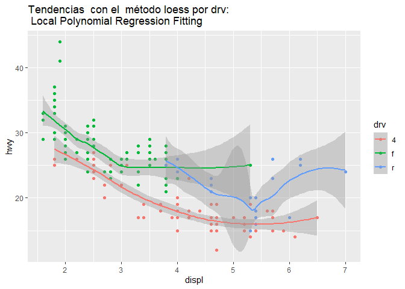<!-- -->


```r
ggplot(data = mpg, mapping = aes(x=displ, y = hwy, color = drv)) + 
  geom_point() + 
  geom_smooth( se = F)
```

```
## `geom_smooth()` using method = 'loess' and formula 'y ~ x'
```

<!-- -->


###  Cuestión 2. 
¿Qué hace el parámetro show.legend = F? ¿Qué pasa si lo eliminamos? ¿Cuando lo añadirías y cuando lo quitarías?

#### Solución 

No sale la leyenda, si lo eliminamos (si existe) sale la leyenda. La leyenda es necesaria cuando hay  decoraciones en el dibujo que vengan asociada a alguna otra variable. En cualquier caso hay que poner la leyenda si es necesaria para la interpretación del trafico.


### Cuestión 3. 
¿Qué hace el parámetro se de la función geom_smooth()? ¿Qué pasa si lo eliminamos? ¿Cuando lo añadirías y cuando lo quitarías?


#### Solución 
Es el parámetro `se`. Es un parámetro lógico que muestra bandas de confianza asociada  para a la variable estimada. Depende del method utilizado para el suavizado. 

### Cuestión 4.
Describe qué hacen los dos siguientes gráficos y di si serán igual y diferente. Justifica tu respuesta.

```
ggplot(data = mpg, mapping = aes(x=displ, y = hwy)) + 
  geom_point() + 
  geom_smooth()

ggplot(data = mpg) + 
  geom_point(mapping = aes(x=displ, y = hwy)) + 
  geom_smooth(mapping = aes(x=displ, y = hwy))
```

#### Solución


```r
ggplot(data = mpg, mapping = aes(x=displ, y = hwy)) + 
  geom_point() + 
  geom_smooth()
```

```
## `geom_smooth()` using method = 'loess' and formula 'y ~ x'
```

<!-- -->

```r
ggplot(data = mpg) + 
  geom_point(mapping = aes(x=displ, y = hwy)) + 
  geom_smooth(mapping = aes(x=displ, y = hwy))
```

```
## `geom_smooth()` using method = 'loess' and formula 'y ~ x'
```

<!-- -->


### Cuestión 5.
Reproduce el código de R que te genera el siguiente gráfico.


#### Solución

Por ejemplo:


```r
ggplot(data = mpg, mapping = aes(x=displ, y = hwy)) + 
  geom_point() + 
  geom_smooth(se=FALSE)
```

```
## `geom_smooth()` using method = 'loess' and formula 'y ~ x'
```

<!-- -->

### Cuestión 6. 
Reproduce el código de R que te genera el siguiente gráfico.


#### Solución

Por ejemplo:


```r
ggplot(data = mpg, mapping = aes(x=displ, y = hwy,group=drv)) + 
  geom_point() + 
  geom_smooth(se=FALSE)
```

```
## `geom_smooth()` using method = 'loess' and formula 'y ~ x'
```

<!-- -->

### Cuestión 7. 
Reproduce el código de R que te genera el siguiente gráfico.


#### Solución


```r
ggplot(data = mpg, mapping = aes(x=displ, y = hwy,color=drv)) + 
  geom_point() + 
  geom_smooth(se=FALSE)
```

```
## `geom_smooth()` using method = 'loess' and formula 'y ~ x'
```

<!-- -->


### Cuestión 8. 
Reproduce el código de R que te genera el siguiente gráfico.


#### Solución


```r
ggplot(data = mpg, mapping = aes(x=displ, y = hwy))+ 
  geom_point(mapping = aes(color=drv,shape=drv)) + 
  geom_smooth(se=FALSE)
```

```
## `geom_smooth()` using method = 'loess' and formula 'y ~ x'
```

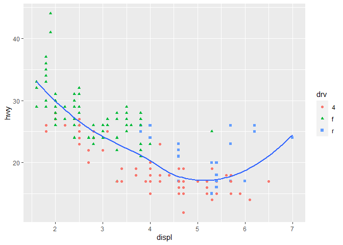<!-- -->

### Cuestión 9. 
Reproduce el código de R que te genera el siguiente gráfico.


#### Solución


```r
ggplot(data = mpg, mapping = aes(x=displ, y = hwy))+ 
  geom_point(mapping = aes(color=drv,shape=drv)) + 
  geom_smooth(mapping = aes(linetype=drv),se=FALSE)
```

```
## `geom_smooth()` using method = 'loess' and formula 'y ~ x'
```

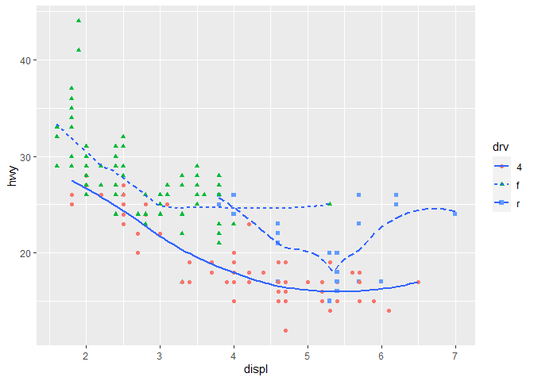<!-- -->


### Cuestión 10.
Reproduce el código de R que te genera el siguiente gráfico. Investiga algunos parámetros adicionales que te harán falta de ggplot2 como stroke entre otros.


#### Solución


```r
ggplot(data = mpg, mapping = aes(x=displ, y = hwy) ) + 
  geom_point(mapping = aes(fill = drv), size = 4, 
             shape = 23, col = "white", stroke = 2) 
```

<!-- -->


## Tarea: Transformaciones estadísticas ggplot. Sección3: Lecciones 22 y 23

Vamos a usar las transformaciones estadísticas básicas aprendidas.
Preguntas de esta tarea

### Cuestión 1

¿Qué hace el parámetro geom_col? ¿En qué se diferencia de geom_bar?

#### Solución

Según la documentación exacta:

*There are two types of bar charts: geom_bar makes the height of the bar proportional to the number of cases in each group (or if the weight aethetic is supplied, the sum of the weights). If you want the heights of the bars to represent values in the data, use geom_col instead. geom_bar uses stat_countby default: it counts the number of cases at each x position. geom_col uses stat_identity: it leaves the data as is.*


El siguiente ejemplo ilustra esta situación


```r
df=as.data.frame(table(diamonds$cut))
df
```

```
##        Var1  Freq
## 1      Fair  1610
## 2      Good  4906
## 3 Very Good 12082
## 4   Premium 13791
## 5     Ideal 21551
```

```r
ggplot(data = df) + 
  geom_col(mapping = aes(x = Var1,y=Freq))
```

<!-- -->

```r
ggplot(data = diamonds) + 
  geom_bar(mapping = aes(x = cut,y=..count..))
```

<!-- -->

```r
ggplot(data = diamonds) + 
  geom_bar(mapping = aes(x = cut),stat="count")
```

<!-- -->

```r
ggplot(data = diamonds,aes(x = cut)) +
  stat_count()
```

<!-- -->

```r
ggplot(data = diamonds,aes(x = cut)) +
  stat_count(geom="bar")
```

<!-- -->


### Cuestión 2.

La gran mayoría de geometrías y de stats vienen por parejas que siempre se utilizan en conjunto. Por ejemplo geom_bar con stat_count. Haz una pasada por la documentación y la chuleta de ggplot y establece una relación entre esas parejas de funciones. ¿Qué tienen todas en común?

#### Solución


```r
str(diamonds)
```

```
## tibble [53,940 x 10] (S3: tbl_df/tbl/data.frame)
##  $ carat  : num [1:53940] 0.23 0.21 0.23 0.29 0.31 0.24 0.24 0.26 0.22 0.23 ...
##  $ cut    : Ord.factor w/ 5 levels "Fair"<"Good"<..: 5 4 2 4 2 3 3 3 1 3 ...
##  $ color  : Ord.factor w/ 7 levels "D"<"E"<"F"<"G"<..: 2 2 2 6 7 7 6 5 2 5 ...
##  $ clarity: Ord.factor w/ 8 levels "I1"<"SI2"<"SI1"<..: 2 3 5 4 2 6 7 3 4 5 ...
##  $ depth  : num [1:53940] 61.5 59.8 56.9 62.4 63.3 62.8 62.3 61.9 65.1 59.4 ...
##  $ table  : num [1:53940] 55 61 65 58 58 57 57 55 61 61 ...
##  $ price  : int [1:53940] 326 326 327 334 335 336 336 337 337 338 ...
##  $ x      : num [1:53940] 3.95 3.89 4.05 4.2 4.34 3.94 3.95 4.07 3.87 4 ...
##  $ y      : num [1:53940] 3.98 3.84 4.07 4.23 4.35 3.96 3.98 4.11 3.78 4.05 ...
##  $ z      : num [1:53940] 2.43 2.31 2.31 2.63 2.75 2.48 2.47 2.53 2.49 2.39 ...
```

```r
ggplot(data = diamonds) + 
  geom_bar(mapping = aes(x = cut,y = ..prop..,group=1))
```

<!-- -->


### Cuestión 3.
¿Qué variables calcula la función stat_smooth? ¿Qué parámetros controlan su comportamiento?

#### Solución

[Ver](https://www.rdocumentation.org/packages/ggplot2/versions/0.9.0/topics/stat_smooth)


### Cuestión 4.
Cuando hemos pintado nuestro diagrama de barras con sus proporciones, necesitamos configurar el parámetro group = 1. ¿Por qué?

#### Solución

Para que calcule las estadísticos agregados para cada niveles de x.

### Cuestión 5.
¿Qué problema tienen los dos siguientes gráficos?

```
ggplot(data = diamonds) + 
  geom_bar(mapping = aes(x = cut, y = ..prop..))

ggplot(data = diamonds) + 
  geom_bar(mapping = aes(x = cut, fill = color, y = ..prop..))
```

#### Solución 


```r
ggplot(data = diamonds) + 
  geom_bar(mapping = aes(x = cut, y = ..prop..,group=1))
```

<!-- -->

```r
prop.table(table(diamonds$color,diamonds$cut),2)
```

```
##    
##           Fair       Good  Very Good    Premium      Ideal
##   D 0.10124224 0.13493681 0.12522761 0.11623523 0.13150202
##   E 0.13913043 0.19017530 0.19864261 0.16945834 0.18110529
##   F 0.19378882 0.18528333 0.17910942 0.16902328 0.17753237
##   G 0.19503106 0.17753771 0.19028307 0.21202233 0.22662521
##   H 0.18819876 0.14309009 0.15096838 0.17112610 0.14454086
##   I 0.10869565 0.10640033 0.09965238 0.10354579 0.09711846
##   J 0.07391304 0.06257644 0.05611654 0.05858893 0.04157580
```

```r
ggplot(data = diamonds,mapping = aes(x = cut,  y = ..prop..,fill=color))+
    geom_bar(position="stack")
```

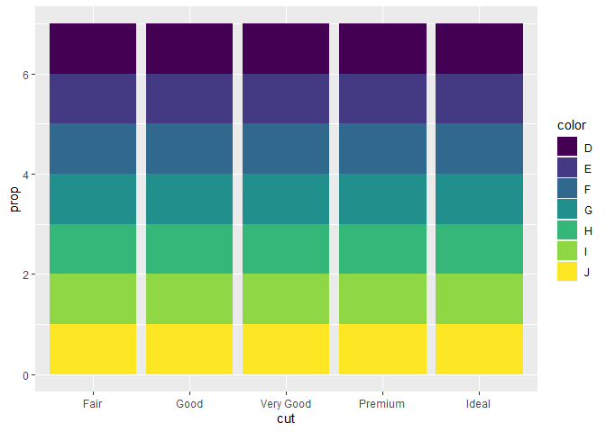<!-- -->

Este último `gplot` parece erróneo ver final del documento.

Otras soluciones razonables, y alguna otra incomprensible:


```r
ggplot(data = diamonds) + 
  geom_bar(mapping = aes(x = cut, fill = color), position = "fill")
```

<!-- -->

```r
ggplot(data = diamonds) + 
  geom_bar(mapping = aes(x = cut, fill = color,y=..count..), position = "fill")
```

<!-- -->

```r
ggplot(data = diamonds) + 
  geom_bar(mapping = aes(x = cut, fill = color,y=..count..), position = "stack")
```

<!-- -->

```r
### Mal funcionamiento del ggplot2 ?¿?¿? escribir 
ggplot(data = diamonds) + 
  geom_bar(mapping = aes(x = cut, fill = color,y=..prop..), position = "stack")
```

<!-- -->


**Por último**

Volvamos al gráfico


```r
ggplot(data = diamonds) + 
  geom_bar(mapping = aes(x = cut, fill = color, y = ..prop..))
```

<!-- -->

Lo que vemos es:

* Que el eje vertical pone prop mientras que sus valores van de 0 a 6.
* Que todas las cajas del fill parecen de la misma altura, nosotros quería que fueran la proporción de `color` en cada clase de `cut`.

Así que la *graph grammar* de ggplot2 no entiende lo que queremos con esta sintaxis.


## Tarea:  Ajustes avanzados ggplo2 . 


###  Cuestión 1.

El siguiente gráfico que genera el código de R es correcto pero puede mejorarse. ¿Qué cosas añadirías para mejorarlo?

```
ggplot(data = mpg, mapping = aes(x = cty, y = hwy )) + 
  geom_point()
```
###  Cuestión 2.

Investiga la documentación de geom_jitter(). ¿Qué parámetros controlan la cantidad de ruido aleatorio (jitter)?

### Cuestión 3.
Compara las funciones geom_jitter contra geom_count y busca semejanzas y diferencias entre ambas.

### Cuestión 4.
¿Cual es el valor por defecto del parámetro position de un geom_boxplot? Usa el dataset de diamonds o de mpg para hacer una visualización que lo demuestre.

##3 Cuestión 5
Convierte un diagrama de barras apilado en un diagrama de sectores o de tarta usando la función coord_polar()

### Cuestión 6.
¿Qué hace la función labs()? Lee la documentación y explícalo correctamente.


### Cuestión 7.
¿En qué se diferencian las funciones coord_quickmap() y coord_map()?

### Cuestión 8.
Investiga las coordenadas coord_fixed() e indica su función.

### Cuestión 9.
Investiga la geometría de la función geom_abline(), geom_vline() y geom_hline() e indica su función respectivamente.

### Cuestión 10.
¿Qué nos indica el gráfico siguiente acerca de la relación entre el consumo en ciudad y en autopista del dataset de mpg?


```r
coef=lm(mpg$hwy~mpg$cty)$coefficients
coef
```

```
## (Intercept)     mpg$cty 
##   0.8920411   1.3374556
```

```r
ggplot(data = mpg, mapping = aes(x = cty, y = hwy )) + 
  geom_point() + 
  geom_abline(slope=coef[2],intercept=coef[1]) 
```

<!-- -->


#### Solución

Notemos que en la versión original del libro R4DS añadía geom_abline() sin parámetros, esto No es correcto como se ve el el siguiente código.
Comentaremos en clase el código.


```r
ggplot(data = mpg, mapping = aes(x = cty, y = hwy )) + 
  geom_point() + 
  geom_smooth(method="lm")+
  coord_fixed()+
  coord_cartesian(xlim=c(-1,40),ylim=c(-1,50))+
  geom_abline()
```

```
## Coordinate system already present. Adding new coordinate system, which will replace the existing one.
```

```
## `geom_smooth()` using formula 'y ~ x'
```

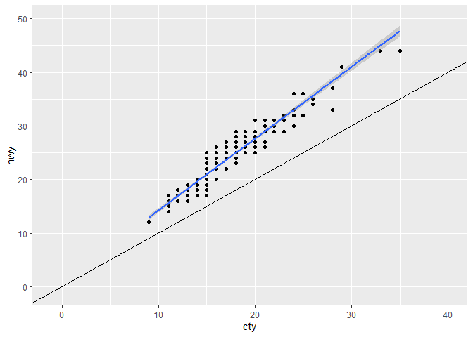<!-- -->
Para evaluar este modelo utilizad el manual  [Practical Regression and Anova using
R](http://www.mathstat.ualberta.ca/~wiens/stat568/misc%20resources/Faraway-PRA.pdf) de de [Julian [Julian J. Faraway] (http://www.maths.bath.ac.uk/~jjf23/) .


```r
lm_model=lm(mpg$hwy~mpg$cty)
summary(lm_model)
```

```
## 
## Call:
## lm(formula = mpg$hwy ~ mpg$cty)
## 
## Residuals:
##     Min      1Q  Median      3Q     Max 
## -5.3408 -1.2790  0.0214  1.0338  4.0461 
## 
## Coefficients:
##             Estimate Std. Error t value Pr(>|t|)    
## (Intercept)  0.89204    0.46895   1.902   0.0584 .  
## mpg$cty      1.33746    0.02697  49.585   <2e-16 ***
## ---
## Signif. codes:  0 '***' 0.001 '**' 0.01 '*' 0.05 '.' 0.1 ' ' 1
## 
## Residual standard error: 1.752 on 232 degrees of freedom
## Multiple R-squared:  0.9138,	Adjusted R-squared:  0.9134 
## F-statistic:  2459 on 1 and 232 DF,  p-value: < 2.2e-16
```

```r
plot(lm_model)
```

<!-- --><!-- -->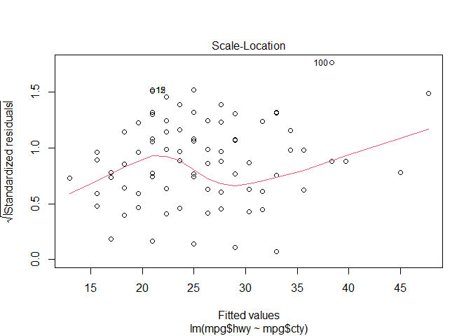<!-- --><!-- -->


```r
ggplot(data = mpg, mapping = aes(x = cty, y = hwy )) + 
    geom_point() + 
    geom_abline()
```

<!-- -->


## Filtrando  datos con dplyr.

Preguntas de esta tarea. El objetivo es que des las instrucciones precisas de `dplyr` que nos dan los vuelos con las condiciones que se indiquen en cada ejercicio.

### Cuestión 1.
Encuentra todos los vuelos que llegaron más de una hora tarde de lo previsto.

#### Solución


```r
library(nycflights13)
filter(flights, arr_delay>60) 
```

```
## # A tibble: 27,789 x 19
##     year month   day dep_time sched_dep_time dep_delay arr_time sched_arr_time
##    <int> <int> <int>    <int>          <int>     <dbl>    <int>          <int>
##  1  2013     1     1      811            630       101     1047            830
##  2  2013     1     1      848           1835       853     1001           1950
##  3  2013     1     1      957            733       144     1056            853
##  4  2013     1     1     1114            900       134     1447           1222
##  5  2013     1     1     1120            944        96     1331           1213
##  6  2013     1     1     1255           1200        55     1451           1330
##  7  2013     1     1     1301           1150        71     1518           1345
##  8  2013     1     1     1337           1220        77     1649           1531
##  9  2013     1     1     1342           1320        22     1617           1504
## 10  2013     1     1     1400           1250        70     1645           1502
## # ... with 27,779 more rows, and 11 more variables: arr_delay <dbl>,
## #   carrier <chr>, flight <int>, tailnum <chr>, origin <chr>, dest <chr>,
## #   air_time <dbl>, distance <dbl>, hour <dbl>, minute <dbl>, time_hour <dttm>
```


### Cuestión 2.
Encuentra todos los vuelos que volaron hacia San Francisco (aeropuertos SFO y OAK)


#### Solución


```r
filter(flights, dest == "SFO" | dest == "OAK") 
```

```
## # A tibble: 13,643 x 19
##     year month   day dep_time sched_dep_time dep_delay arr_time sched_arr_time
##    <int> <int> <int>    <int>          <int>     <dbl>    <int>          <int>
##  1  2013     1     1      558            600        -2      923            937
##  2  2013     1     1      611            600        11      945            931
##  3  2013     1     1      655            700        -5     1037           1045
##  4  2013     1     1      729            730        -1     1049           1115
##  5  2013     1     1      734            737        -3     1047           1113
##  6  2013     1     1      745            745         0     1135           1125
##  7  2013     1     1      746            746         0     1119           1129
##  8  2013     1     1      803            800         3     1132           1144
##  9  2013     1     1      826            817         9     1145           1158
## 10  2013     1     1     1029           1030        -1     1427           1355
## # ... with 13,633 more rows, and 11 more variables: arr_delay <dbl>,
## #   carrier <chr>, flight <int>, tailnum <chr>, origin <chr>, dest <chr>,
## #   air_time <dbl>, distance <dbl>, hour <dbl>, minute <dbl>, time_hour <dttm>
```

### Cuestión 3.
Encuentra todos los vuelos operados por United American (UA) o por American Airlines (AA)

#### Solución


```r
filter(flights, carrier == "UA" | carrier == "AA") 
```

```
## # A tibble: 91,394 x 19
##     year month   day dep_time sched_dep_time dep_delay arr_time sched_arr_time
##    <int> <int> <int>    <int>          <int>     <dbl>    <int>          <int>
##  1  2013     1     1      517            515         2      830            819
##  2  2013     1     1      533            529         4      850            830
##  3  2013     1     1      542            540         2      923            850
##  4  2013     1     1      554            558        -4      740            728
##  5  2013     1     1      558            600        -2      753            745
##  6  2013     1     1      558            600        -2      924            917
##  7  2013     1     1      558            600        -2      923            937
##  8  2013     1     1      559            600        -1      941            910
##  9  2013     1     1      559            600        -1      854            902
## 10  2013     1     1      606            610        -4      858            910
## # ... with 91,384 more rows, and 11 more variables: arr_delay <dbl>,
## #   carrier <chr>, flight <int>, tailnum <chr>, origin <chr>, dest <chr>,
## #   air_time <dbl>, distance <dbl>, hour <dbl>, minute <dbl>, time_hour <dttm>
```

### Cuestión 8.4.
Encuentra todos los vuelos que salieron los meses de primavera (Abril, Mayo y Junio)

#### Solución


```r
filter(flights, month %in% c(4,5,6))
```

```
## # A tibble: 85,369 x 19
##     year month   day dep_time sched_dep_time dep_delay arr_time sched_arr_time
##    <int> <int> <int>    <int>          <int>     <dbl>    <int>          <int>
##  1  2013     4     1      454            500        -6      636            640
##  2  2013     4     1      509            515        -6      743            814
##  3  2013     4     1      526            530        -4      812            827
##  4  2013     4     1      534            540        -6      833            850
##  5  2013     4     1      542            545        -3      914            920
##  6  2013     4     1      543            545        -2      921            927
##  7  2013     4     1      551            600        -9      748            659
##  8  2013     4     1      552            600        -8      641            701
##  9  2013     4     1      553            600        -7      725            735
## 10  2013     4     1      554            600        -6      752            805
## # ... with 85,359 more rows, and 11 more variables: arr_delay <dbl>,
## #   carrier <chr>, flight <int>, tailnum <chr>, origin <chr>, dest <chr>,
## #   air_time <dbl>, distance <dbl>, hour <dbl>, minute <dbl>, time_hour <dttm>
```

### Cuestión 5.
Encuentra todos los vuelos que llegaron más de una hora tarde pero salieron con menos de una hora de retraso.

#### Solución


```r
filter(flights, arr_delay > 60, dep_delay <= 60) 
```

```
## # A tibble: 5,124 x 19
##     year month   day dep_time sched_dep_time dep_delay arr_time sched_arr_time
##    <int> <int> <int>    <int>          <int>     <dbl>    <int>          <int>
##  1  2013     1     1     1255           1200        55     1451           1330
##  2  2013     1     1     1342           1320        22     1617           1504
##  3  2013     1     1     1402           1323        39     1650           1526
##  4  2013     1     1     1411           1315        56     1717           1611
##  5  2013     1     1     1424           1349        35     1701           1556
##  6  2013     1     1     1428           1329        59     1803           1640
##  7  2013     1     1     1558           1534        24     1808           1703
##  8  2013     1     1     1604           1510        54     1817           1710
##  9  2013     1     1     1608           1535        33     2002           1850
## 10  2013     1     1     1630           1548        42     1902           1755
## # ... with 5,114 more rows, and 11 more variables: arr_delay <dbl>,
## #   carrier <chr>, flight <int>, tailnum <chr>, origin <chr>, dest <chr>,
## #   air_time <dbl>, distance <dbl>, hour <dbl>, minute <dbl>, time_hour <dttm>
```

### Cuestión 6.
Encuentra todos los vuelos que salieron con más de una hora de retraso pero consiguieron llegar con menos de 30 minutos de retraso (el avión aceleró en el aire)

#### Solución


```r
filter(flights, arr_delay > 60, dep_delay <= 30) 
```

```
## # A tibble: 1,986 x 19
##     year month   day dep_time sched_dep_time dep_delay arr_time sched_arr_time
##    <int> <int> <int>    <int>          <int>     <dbl>    <int>          <int>
##  1  2013     1     1     1342           1320        22     1617           1504
##  2  2013     1     1     1558           1534        24     1808           1703
##  3  2013     1     1     1751           1745         6     2015           1910
##  4  2013     1     1     2000           1930        30     2255           2140
##  5  2013     1     2      841            845        -4     1134           1024
##  6  2013     1     2      928            905        23     1331           1229
##  7  2013     1     2     1558           1600        -2     1923           1820
##  8  2013     1     6      654            655        -1     1025            921
##  9  2013     1     6      906            904         2     1313           1210
## 10  2013     1     6     1932           1910        22     2318           2204
## # ... with 1,976 more rows, and 11 more variables: arr_delay <dbl>,
## #   carrier <chr>, flight <int>, tailnum <chr>, origin <chr>, dest <chr>,
## #   air_time <dbl>, distance <dbl>, hour <dbl>, minute <dbl>, time_hour <dttm>
```

### Cuestión 7
Encuentra todos los vuelos que salen entre medianoche y las 7 de la mañana (vuelos nocturnos).

#### Solución


```r
filter(flights, hour >= 0, hour < 7) 
```

```
## # A tibble: 27,905 x 19
##     year month   day dep_time sched_dep_time dep_delay arr_time sched_arr_time
##    <int> <int> <int>    <int>          <int>     <dbl>    <int>          <int>
##  1  2013     1     1      517            515         2      830            819
##  2  2013     1     1      533            529         4      850            830
##  3  2013     1     1      542            540         2      923            850
##  4  2013     1     1      544            545        -1     1004           1022
##  5  2013     1     1      554            600        -6      812            837
##  6  2013     1     1      554            558        -4      740            728
##  7  2013     1     1      555            600        -5      913            854
##  8  2013     1     1      557            600        -3      709            723
##  9  2013     1     1      557            600        -3      838            846
## 10  2013     1     1      558            600        -2      753            745
## # ... with 27,895 more rows, and 11 more variables: arr_delay <dbl>,
## #   carrier <chr>, flight <int>, tailnum <chr>, origin <chr>, dest <chr>,
## #   air_time <dbl>, distance <dbl>, hour <dbl>, minute <dbl>, time_hour <dttm>
```

### Cuestión 8.
Investiga el uso de la función `between()` de `dplyr`. ¿Qué hace? Puedes usarlo para resolver la sintaxis necesaria para responder alguna de las preguntas anteriores?

#### Solución


```r
filter(flights, between(hour,0,6)) 
```

```
## # A tibble: 27,905 x 19
##     year month   day dep_time sched_dep_time dep_delay arr_time sched_arr_time
##    <int> <int> <int>    <int>          <int>     <dbl>    <int>          <int>
##  1  2013     1     1      517            515         2      830            819
##  2  2013     1     1      533            529         4      850            830
##  3  2013     1     1      542            540         2      923            850
##  4  2013     1     1      544            545        -1     1004           1022
##  5  2013     1     1      554            600        -6      812            837
##  6  2013     1     1      554            558        -4      740            728
##  7  2013     1     1      555            600        -5      913            854
##  8  2013     1     1      557            600        -3      709            723
##  9  2013     1     1      557            600        -3      838            846
## 10  2013     1     1      558            600        -2      753            745
## # ... with 27,895 more rows, and 11 more variables: arr_delay <dbl>,
## #   carrier <chr>, flight <int>, tailnum <chr>, origin <chr>, dest <chr>,
## #   air_time <dbl>, distance <dbl>, hour <dbl>, minute <dbl>, time_hour <dttm>
```

### Cuestión 9.
¿Cuantos vuelos tienen un valor desconocido de `dep_time`?

#### Solución


```r
filter(flights, is.na(dep_time)) 
```

```
## # A tibble: 8,255 x 19
##     year month   day dep_time sched_dep_time dep_delay arr_time sched_arr_time
##    <int> <int> <int>    <int>          <int>     <dbl>    <int>          <int>
##  1  2013     1     1       NA           1630        NA       NA           1815
##  2  2013     1     1       NA           1935        NA       NA           2240
##  3  2013     1     1       NA           1500        NA       NA           1825
##  4  2013     1     1       NA            600        NA       NA            901
##  5  2013     1     2       NA           1540        NA       NA           1747
##  6  2013     1     2       NA           1620        NA       NA           1746
##  7  2013     1     2       NA           1355        NA       NA           1459
##  8  2013     1     2       NA           1420        NA       NA           1644
##  9  2013     1     2       NA           1321        NA       NA           1536
## 10  2013     1     2       NA           1545        NA       NA           1910
## # ... with 8,245 more rows, and 11 more variables: arr_delay <dbl>,
## #   carrier <chr>, flight <int>, tailnum <chr>, origin <chr>, dest <chr>,
## #   air_time <dbl>, distance <dbl>, hour <dbl>, minute <dbl>, time_hour <dttm>
```

Podrían haber (en este dataset no)  NULLs u otros desconocidos dependiendo cómo se han codificado estos valores.


### Cuestión 10.
¿Qué variables del dataset contienen valores desconocidos? ¿Qué representan esas filas donde faltan los datos?

#### Solución

Todo lo que sigue son  suposiciones, siempre hay que comprobar el motivo de tener datos raros. 
Los campos desconocidos son fechas de salida/llegada así como retraso de salida/llegada. Puede que se trate de vuelos cancelados, sobretodo por las cifras que manejamos (unos 8000 vuelos anuales). 


### Cuestión 11.
Ahora vas a sorprenderte con la magia oscura... Contesta que dan las siguientes condiciones booleanas

```
NA^0
NA|TRUE
FALSE&NA
```
 Intenta establecer la regla general para saber cuando es o no es `NA` (cuidado con `NA*0`)

#### Solución
NA no es un número es NA.... AH pero es un `logical`, no sé el motivo de que de 1 cuando hacemos `NA^0` resultado. Las demás instrucciones sí son bastante "lógicas" un `OR`  con un TRUE es siempre TRUE independientemente de que se desconozca la otra entrada del OR,  es similar el comportamiento con FALSE


```r
class(NA)
```

```
## [1] "logical"
```

```r
str(NA)
```

```
##  logi NA
```

```r
mode(NA)
```

```
## [1] "logical"
```

```r
typeof(NA)
```

```
## [1] "logical"
```
Cuidado!!!! cosas que pasan con los lenguajes que no controlan los tipos de datos.


```r
0^0
```

```
## [1] 1
```

```r
FALSE^0
```

```
## [1] 1
```

```r
TRUE^0
```

```
## [1] 1
```

```r
NA^0
```

```
## [1] 1
```

```r
NA^1
```

```
## [1] NA
```


## Tarea Ordenación y selección de datos con dplyr.

Repasa las funciones `arrange` y `select` de `dplyr` para comprobar que has entendido como funcionan.
Preguntas de esta tarea

### Cuestión 1.
Piensa cómo podrías usar la función `arrange()` para colocar todos los valores NA al inicio. Pista: puedes usar la función `is.na()` en lugar de la función `desc()` como argumento de `arrange`.

#### Solución


```r
arrange(flights,!is.na(dep_time)) 
```

```
## # A tibble: 336,776 x 19
##     year month   day dep_time sched_dep_time dep_delay arr_time sched_arr_time
##    <int> <int> <int>    <int>          <int>     <dbl>    <int>          <int>
##  1  2013     1     1       NA           1630        NA       NA           1815
##  2  2013     1     1       NA           1935        NA       NA           2240
##  3  2013     1     1       NA           1500        NA       NA           1825
##  4  2013     1     1       NA            600        NA       NA            901
##  5  2013     1     2       NA           1540        NA       NA           1747
##  6  2013     1     2       NA           1620        NA       NA           1746
##  7  2013     1     2       NA           1355        NA       NA           1459
##  8  2013     1     2       NA           1420        NA       NA           1644
##  9  2013     1     2       NA           1321        NA       NA           1536
## 10  2013     1     2       NA           1545        NA       NA           1910
## # ... with 336,766 more rows, and 11 more variables: arr_delay <dbl>,
## #   carrier <chr>, flight <int>, tailnum <chr>, origin <chr>, dest <chr>,
## #   air_time <dbl>, distance <dbl>, hour <dbl>, minute <dbl>, time_hour <dttm>
```


### Cuestión 2.
Ordena los vuelos de `flights` para encontrar los vuelos más retrasados en la salida. ¿Qué vuelos fueron los que salieron los primeros antes de lo previsto?

#### Solución
  


```r
# El vuelo con mayor retraso fue
arrange(flights, desc(dep_delay))[1:2,] #muestro los dos primero podría haber empates
```

```
## # A tibble: 2 x 19
##    year month   day dep_time sched_dep_time dep_delay arr_time sched_arr_time
##   <int> <int> <int>    <int>          <int>     <dbl>    <int>          <int>
## 1  2013     1     9      641            900      1301     1242           1530
## 2  2013     6    15     1432           1935      1137     1607           2120
## # ... with 11 more variables: arr_delay <dbl>, carrier <chr>, flight <int>,
## #   tailnum <chr>, origin <chr>, dest <chr>, air_time <dbl>, distance <dbl>,
## #   hour <dbl>, minute <dbl>, time_hour <dttm>
```

```r
# El vuelo con menor retraso fue
arrange(flights, dep_delay)[1:2,] 
```

```
## # A tibble: 2 x 19
##    year month   day dep_time sched_dep_time dep_delay arr_time sched_arr_time
##   <int> <int> <int>    <int>          <int>     <dbl>    <int>          <int>
## 1  2013    12     7     2040           2123       -43       40           2352
## 2  2013     2     3     2022           2055       -33     2240           2338
## # ... with 11 more variables: arr_delay <dbl>, carrier <chr>, flight <int>,
## #   tailnum <chr>, origin <chr>, dest <chr>, air_time <dbl>, distance <dbl>,
## #   hour <dbl>, minute <dbl>, time_hour <dttm>
```


### Cuestión 3.
Ordena los vuelos de `flights` para encontrar los vuelos más rápidos. Usa el concepto de rapidez que consideres. 

#### Solución
Por ejemplo distancia/tiempo volando


```r
arrange(flights, desc(distance/air_time)) 
```

```
## # A tibble: 336,776 x 19
##     year month   day dep_time sched_dep_time dep_delay arr_time sched_arr_time
##    <int> <int> <int>    <int>          <int>     <dbl>    <int>          <int>
##  1  2013     5    25     1709           1700         9     1923           1937
##  2  2013     7     2     1558           1513        45     1745           1719
##  3  2013     5    13     2040           2025        15     2225           2226
##  4  2013     3    23     1914           1910         4     2045           2043
##  5  2013     1    12     1559           1600        -1     1849           1917
##  6  2013    11    17      650            655        -5     1059           1150
##  7  2013     2    21     2355           2358        -3      412            438
##  8  2013    11    17      759            800        -1     1212           1255
##  9  2013    11    16     2003           1925        38       17             36
## 10  2013    11    16     2349           2359       -10      402            440
## # ... with 336,766 more rows, and 11 more variables: arr_delay <dbl>,
## #   carrier <chr>, flight <int>, tailnum <chr>, origin <chr>, dest <chr>,
## #   air_time <dbl>, distance <dbl>, hour <dbl>, minute <dbl>, time_hour <dttm>
```


### Cuestión 4.
¿Qué vuelos tienen los trayectos más largos? Busca en Wikipedia qué dos aeropuertos del dataset alojan los vuelos más largos. 

#### Solución

[Wikipedia: Longest flights](https://en.wikipedia.org/wiki/Longest_flights)  


Vuelos entre el JFK de Nueva York y el HNL, aeropuerto internacional de Honolulu en Hawaii (claro que todos los vuelos parece ser de territorio de EEUU)


### Cuestión 5.
¿Qué vuelos tienen los trayectos más cortos? Busca en Wikipedia qué dos aeropuertos del dataset alojan los vuelos más largos. 

#### Solución

Vuelos entre el EWR, Aeropuerto Internacional Libertad de Newark  y LGA, Aeropuerto de La Guardia, ambos situados en el estado de Nueva York.

### Cuestión 6.
Dale al coco para pensar cuantas más maneras posibles de seleccionar los campos `dep_time`, `dep_delay`, `arr_time` y `arr_delay` del dataset de `flights`. 

#### Solución

Puedes hacerlo directamente o bien usando las diferentes funciones que hemos visto en la sección. Algunos ejemplos son:

```r
select(flights,dep_time, dep_delay, arr_time, arr_delay)
```

```
## # A tibble: 336,776 x 4
##    dep_time dep_delay arr_time arr_delay
##       <int>     <dbl>    <int>     <dbl>
##  1      517         2      830        11
##  2      533         4      850        20
##  3      542         2      923        33
##  4      544        -1     1004       -18
##  5      554        -6      812       -25
##  6      554        -4      740        12
##  7      555        -5      913        19
##  8      557        -3      709       -14
##  9      557        -3      838        -8
## 10      558        -2      753         8
## # ... with 336,766 more rows
```

```r
select(flights,starts_with("dep"), starts_with("arr"))
```

```
## # A tibble: 336,776 x 4
##    dep_time dep_delay arr_time arr_delay
##       <int>     <dbl>    <int>     <dbl>
##  1      517         2      830        11
##  2      533         4      850        20
##  3      542         2      923        33
##  4      544        -1     1004       -18
##  5      554        -6      812       -25
##  6      554        -4      740        12
##  7      555        -5      913        19
##  8      557        -3      709       -14
##  9      557        -3      838        -8
## 10      558        -2      753         8
## # ... with 336,766 more rows
```

```r
select(flights,ends_with("time"), ends_with("delay") -starts_with("sched"),-starts_with("air") )
```

```
## # A tibble: 336,776 x 5
##    dep_time sched_dep_time arr_time sched_arr_time  year
##       <int>          <int>    <int>          <int> <int>
##  1      517            515      830            819  2013
##  2      533            529      850            830  2013
##  3      542            540      923            850  2013
##  4      544            545     1004           1022  2013
##  5      554            600      812            837  2013
##  6      554            558      740            728  2013
##  7      555            600      913            854  2013
##  8      557            600      709            723  2013
##  9      557            600      838            846  2013
## 10      558            600      753            745  2013
## # ... with 336,766 more rows
```


### Cuestión 7.
¿Qué ocurre si pones el nombre de una misma variable varias veces en una `select()`?

#### Solución
Solo sale una vez


```r
select(flights, distance, distance, distance) 
```

```
## # A tibble: 336,776 x 1
##    distance
##       <dbl>
##  1     1400
##  2     1416
##  3     1089
##  4     1576
##  5      762
##  6      719
##  7     1065
##  8      229
##  9      944
## 10      733
## # ... with 336,766 more rows
```
Si la pones y la quitas pasa esto


```r
select(flights, distance, distance, -distance) 
```

```
## # A tibble: 336,776 x 0
```

### Cuestión 8.
Investiga el uso de la función `one_of()` de dplyr. 

#### Solución
Permite añadir las variables en string dentro de un vector. Muy útil si es el resultado de un programa que ha devuelto un array de variables que queremos seleccionar automáticamente. En el help sale el package `tydeselect`.


Por ejemplo


```r
col=c("distance", "distance", "distance","delay","air_time")
flights %>% select(one_of(col)) %>% head
```

```
## Warning: Unknown columns: `delay`
```

```
## # A tibble: 6 x 2
##   distance air_time
##      <dbl>    <dbl>
## 1     1400      227
## 2     1416      227
## 3     1089      160
## 4     1576      183
## 5      762      116
## 6      719      150
```


### Cuestión 9.

Investiga cómo puede ser útil la función `one_of()` de la pregunta anterior en conjunción con el vector de variables 

```
c("year", "month", "day", "dep_delay", "arr_delay")
```

#### Solución

Pues lo probamos:


```r
select(flights, one_of(c("year", "month", "day", "dep_delay", "arr_delay"))) 
```

```
## # A tibble: 336,776 x 5
##     year month   day dep_delay arr_delay
##    <int> <int> <int>     <dbl>     <dbl>
##  1  2013     1     1         2        11
##  2  2013     1     1         4        20
##  3  2013     1     1         2        33
##  4  2013     1     1        -1       -18
##  5  2013     1     1        -6       -25
##  6  2013     1     1        -4        12
##  7  2013     1     1        -5        19
##  8  2013     1     1        -3       -14
##  9  2013     1     1        -3        -8
## 10  2013     1     1        -2         8
## # ... with 336,766 more rows
```

Y es claro lo que hace.

### Cuestión 10.

Intenta averiguar el resultado del siguiente código. Luego ejecútalo y a ver si el resultado te sorprende.

```
select(flights, contains("time"))
```

Intenta averiguar cómo lo hacen las funciones de ayuda de la `select` para tratar el caso por defecto y cómo lo puedes cambiar.


#### Solución

Nos devuelve todas las variables que tienen la palabra "time" en su nombre (no las que sean de tipo tiempo). Muy útil cuando queremos localizar todo lo que tiene que ver con tiempo.


```r
select(flights, contains("time"))
```

```
## # A tibble: 336,776 x 6
##    dep_time sched_dep_time arr_time sched_arr_time air_time time_hour          
##       <int>          <int>    <int>          <int>    <dbl> <dttm>             
##  1      517            515      830            819      227 2013-01-01 05:00:00
##  2      533            529      850            830      227 2013-01-01 05:00:00
##  3      542            540      923            850      160 2013-01-01 05:00:00
##  4      544            545     1004           1022      183 2013-01-01 05:00:00
##  5      554            600      812            837      116 2013-01-01 06:00:00
##  6      554            558      740            728      150 2013-01-01 05:00:00
##  7      555            600      913            854      158 2013-01-01 06:00:00
##  8      557            600      709            723       53 2013-01-01 06:00:00
##  9      557            600      838            846      140 2013-01-01 06:00:00
## 10      558            600      753            745      138 2013-01-01 06:00:00
## # ... with 336,766 more rows
```


## Taller Calculando nuevas variables con dplyr.

Repasa las funciones `mutate`, `transmutate` y todas las variantes que se pueden usar antes de hacer los siguientes ejercicios.
Preguntas de esta tarea

### Cuestión 1.

El dataset de vuelos tiene dos variables, `dep_time` y `sched_dep_time` muy útiles pero difíciles de usar por cómo vienen dadas al no ser variables continuas. Fíjate que cuando pone 559, se refiere a que el vuelo salió a las 5:59... 

Convierte este dato en otro más útil que represente el número de minutos desde las 00:00 horas de la media noche. 


#### Solución


```r
transmute(flights,
          dep_time, sched_dep_time,
          new_dep_time = 60*dep_time %/% 100 + dep_time %% 100,
          new_sched_dep_time = 60*sched_dep_time %/% 100 + sched_dep_time %% 100
          )
```

```
## # A tibble: 336,776 x 4
##    dep_time sched_dep_time new_dep_time new_sched_dep_time
##       <int>          <int>        <dbl>              <dbl>
##  1      517            515          317                315
##  2      533            529          333                329
##  3      542            540          342                340
##  4      544            545          344                345
##  5      554            600          354                360
##  6      554            558          354                358
##  7      555            600          355                360
##  8      557            600          357                360
##  9      557            600          357                360
## 10      558            600          358                360
## # ... with 336,766 more rows
```


### Cuestión 2.
Compara las variables `air_time` contra `arr_time - dep_time`. 

* ¿Qué esperas ver?
* ¿Qué ves realmente?
* ¿Se te ocurre algo para mejorarlo y corregirlo?


#### Solución
Pues parece que las previsiones no se cumplen ¿será por la manera de codificar el tiempo en horas minutos?, aunque no se desvía demasiado. En teoría si los datos son  en minutos `air_time` y `new_air_time` deberían ser iguales ....?¿


```r
transmute(flights,air_time, air_time_minutes=60*air_time %/% 100 + air_time %% 100, new_dep_time = 60*dep_time %/% 100 + dep_time %% 100,
          new_arr_time = 60*arr_time %/% 100 + arr_time %% 100,
          new_air_time = new_arr_time - new_dep_time
          )
```

```
## # A tibble: 336,776 x 5
##    air_time air_time_minutes new_dep_time new_arr_time new_air_time
##       <dbl>            <dbl>        <dbl>        <dbl>        <dbl>
##  1      227              147          317          510          193
##  2      227              147          333          530          197
##  3      160              120          342          563          221
##  4      183              143          344          604          260
##  5      116               76          354          492          138
##  6      150              110          354          460          106
##  7      158              118          355          553          198
##  8       53               53          357          429           72
##  9      140              100          357          518          161
## 10      138               98          358          473          115
## # ... with 336,766 more rows
```


```r
transmute(flights, air_time,
  air_time_minutes = 60 * air_time %/% 100 + air_time %% 100,
  sched_new_dep_time = 60 * sched_dep_time %/% 100 + sched_dep_time  %% 100,
  sched_new_arr_time = 60 * sched_arr_time %/% 100 + sched_arr_time  %% 100,
  new_air_time = sched_new_arr_time - sched_new_dep_time
)
```

```
## # A tibble: 336,776 x 5
##    air_time air_time_minutes sched_new_dep_time sched_new_arr_time new_air_time
##       <dbl>            <dbl>              <dbl>              <dbl>        <dbl>
##  1      227              147                315                499          184
##  2      227              147                329                510          181
##  3      160              120                340                530          190
##  4      183              143                345                622          277
##  5      116               76                360                517          157
##  6      150              110                358                448           90
##  7      158              118                360                534          174
##  8       53               53                360                443           83
##  9      140              100                360                526          166
## 10      138               98                360                465          105
## # ... with 336,766 more rows
```

### Cuestión 3.
Compara los valores de `dep_time`, `sched_dep_time` y `dep_delay`. Cómo deberían relacionarse estos tres números? Compruébalo y haz las correcciones numéricas que necesitas.

#### Solución

En este caso los primero valores de `new_delay`y `dep_delay` sí parecen coincidir


```r
transmute(flights,new_dep_time = 60*dep_time %/% 100 + dep_time %% 100,
          new_sched_dep_time = 60*sched_dep_time %/% 100 + sched_dep_time %% 100,
          new_delay = new_dep_time - new_sched_dep_time,
          dep_delay,new_delay==dep_delay
          )
```

```
## # A tibble: 336,776 x 5
##    new_dep_time new_sched_dep_time new_delay dep_delay `new_delay == dep_delay`
##           <dbl>              <dbl>     <dbl>     <dbl> <lgl>                   
##  1          317                315         2         2 TRUE                    
##  2          333                329         4         4 TRUE                    
##  3          342                340         2         2 TRUE                    
##  4          344                345        -1        -1 TRUE                    
##  5          354                360        -6        -6 TRUE                    
##  6          354                358        -4        -4 TRUE                    
##  7          355                360        -5        -5 TRUE                    
##  8          357                360        -3        -3 TRUE                    
##  9          357                360        -3        -3 TRUE                    
## 10          358                360        -2        -2 TRUE                    
## # ... with 336,766 more rows
```


### Cuestión 4.
Usa una de las funciones de ranking para quedarte con los 10 vuelos más retrasados de todos. 


#### Solución
Fijaros bien: hacemos un mutate para obtener la variable `r-delay`y luego ordenamos `flights` por esa variable con `arrange`


```r
arrange(mutate(flights,
               r_delay = min_rank(dep_delay)),
        r_delay
        )[1:10,]
```

```
## # A tibble: 10 x 20
##     year month   day dep_time sched_dep_time dep_delay arr_time sched_arr_time
##    <int> <int> <int>    <int>          <int>     <dbl>    <int>          <int>
##  1  2013    12     7     2040           2123       -43       40           2352
##  2  2013     2     3     2022           2055       -33     2240           2338
##  3  2013    11    10     1408           1440       -32     1549           1559
##  4  2013     1    11     1900           1930       -30     2233           2243
##  5  2013     1    29     1703           1730       -27     1947           1957
##  6  2013     8     9      729            755       -26     1002            955
##  7  2013    10    23     1907           1932       -25     2143           2143
##  8  2013     3    30     2030           2055       -25     2213           2250
##  9  2013     3     2     1431           1455       -24     1601           1631
## 10  2013     5     5      934            958       -24     1225           1309
## # ... with 12 more variables: arr_delay <dbl>, carrier <chr>, flight <int>,
## #   tailnum <chr>, origin <chr>, dest <chr>, air_time <dbl>, distance <dbl>,
## #   hour <dbl>, minute <dbl>, time_hour <dttm>, r_delay <int>
```


### Cuestión 5.
Aunque la ejecución te de una advertencia, qué resultado te da la operación

```
1:6 + 1:20
```

#### Solución


```r
aux1=1:6 + 1:20
```

```
## Warning in 1:6 + 1:20: longitud de objeto mayor no es múltiplo de la longitud de
## uno menor
```

```r
aux1
```

```
##  [1]  2  4  6  8 10 12  8 10 12 14 16 18 14 16 18 20 22 24 20 22
```

Es equivalente a 


```r
c(1:6,1:6,1:6,1,2)
```

```
##  [1] 1 2 3 4 5 6 1 2 3 4 5 6 1 2 3 4 5 6 1 2
```

```r
1:20
```

```
##  [1]  1  2  3  4  5  6  7  8  9 10 11 12 13 14 15 16 17 18 19 20
```

```r
aux2=c(1:6,1:6,1:6,1,2) + 1:20
aux2
```

```
##  [1]  2  4  6  8 10 12  8 10 12 14 16 18 14 16 18 20 22 24 20 22
```

```r
aux2==aux1
```

```
##  [1] TRUE TRUE TRUE TRUE TRUE TRUE TRUE TRUE TRUE TRUE TRUE TRUE TRUE TRUE TRUE
## [16] TRUE TRUE TRUE TRUE TRUE
```

```r
all(aux2==aux1)
```

```
## [1] TRUE
```


### Cuestión 6.
Además de todas las funciones que hemos dicho, las trigonométricas también son funciones vectoriales que podemos usar para hacer transformaciones con mutate. Investiga cuáles trae R y cuál es la sintaxis de cada una de ellas.


### Solución

Esta información se encuentra en `help(cos)` son el seno, coseno y la tangente y sus vertientes hiperbólicas.


## Taller evaluación: Filtrado y manipulación de datos

Es un taller con cuestiones globales

Preguntas de esta tarea

### Cuestión 1.
Intenta describir con frases comprensibles el conjunto de vuelos retrasados. Intenta dar afirmaciones como por ejemplo:

* Un vuelo tiende a salir unos 20 minutos antes el 50% de las veces y a salir tarde el 50% de las veces restantes.
* Los vuelos de la compañía XX llegan siempre 20 minutos tarde.
* El 95% de los vuelos a HNL llegan a tiempo, pero el 5% restante se retrasan más de 3 horas.

Intenta dar por lo menos 5 afirmaciones verídicas en base a los datos que tenemos disponibles.


#### Solución


```r
# Un vuelo tiende a salir unos 20 minutos antes el 50% de las veces y a salir tarde el 50% de las veces restantes.
flights %>% summarise(median = median(dep_delay,na.rm = TRUE))
```

```
## # A tibble: 1 x 1
##   median
##    <dbl>
## 1     -2
```

```r
# Los vuelos de la compañía XX llegan siempre 20 minutos tarde.
flights %>% transmute(carrier,delay_gt_20=dep_delay>20,delay_lt_20=dep_delay<=20)%>%
  group_by(carrier) %>% summarise(n_delay_gt=sum(delay_gt_20,na.rm=TRUE),n_delay_lt=sum(delay_lt_20,na.rm=TRUE),percent_gt_20=round(n_delay_gt/(n_delay_gt+n_delay_lt)*100,2)) %>% arrange(desc(percent_gt_20))
```

```
## # A tibble: 16 x 4
##    carrier n_delay_gt n_delay_lt percent_gt_20
##    <chr>        <int>      <int>         <dbl>
##  1 EV           14148      37208         27.6 
##  2 YV             144        401         26.4 
##  3 F9             163        519         23.9 
##  4 9E            4018      13398         23.1 
##  5 WN            2740       9343         22.7 
##  6 FL             716       2471         22.5 
##  7 OO               6         23         20.7 
##  8 B6           10728      43441         19.8 
##  9 MQ            4720      20443         18.8 
## 10 UA           10236      47743         17.6 
## 11 VX             753       4378         14.7 
## 12 AA            4443      27650         13.8 
## 13 DL            6611      41150         13.8 
## 14 AS              78        634         11.0 
## 15 US            2108      17765         10.6 
## 16 HA              21        321          6.14
```

```r
# El 95% de los vuelos a HNL (tomaremos HA pues NHL no aparece) llegan a tiempo, pero el 5% restante se retrasan más de 3 horas.

flights %>% filter(dest=="HNL") %>%  
  transmute(dest,no_delay=dep_delay<=0,delay_gt_180=dep_delay>=180)%>%
  summarise(
    no_delay_percent=sum(no_delay,na.rm=TRUE)/(sum(no_delay,na.rm=TRUE)+sum(!no_delay,na.rm=TRUE)),   delay_gt_180=sum(delay_gt_180,na.rm=TRUE)/(sum(delay_gt_180,na.rm=TRUE)+sum(!delay_gt_180,na.rm=TRUE))
    )
```

```
## # A tibble: 1 x 2
##   no_delay_percent delay_gt_180
##              <dbl>        <dbl>
## 1            0.599       0.0113
```

### Cuestión 2.
Da una versión equivalente a las pipes siguientes sin usar la función count:

```
not_cancelled <- flights %>%  count(dest)
not_cancelled <- count(tailnum, wt = distance)
```

#### Solución

Primero agrupamos con `group_by()` y luego contamos con `tally` en el primer caso sin pesos y en el segundo con pesos la variable `distance` (`help(count)`) sugiere estas instrucciones como definición del atajo `count()`)


```r
not_cancelled <-flights %>% group_by(dest) %>% tally() # 
not_cancelled_enunciado <- flights %>%  count(dest)
not_cancelled
```

```
## # A tibble: 105 x 2
##    dest      n
##    <chr> <int>
##  1 ABQ     254
##  2 ACK     265
##  3 ALB     439
##  4 ANC       8
##  5 ATL   17215
##  6 AUS    2439
##  7 AVL     275
##  8 BDL     443
##  9 BGR     375
## 10 BHM     297
## # ... with 95 more rows
```

```r
not_cancelled_enunciado
```

```
## # A tibble: 105 x 2
##    dest      n
##    <chr> <int>
##  1 ABQ     254
##  2 ACK     265
##  3 ALB     439
##  4 ANC       8
##  5 ATL   17215
##  6 AUS    2439
##  7 AVL     275
##  8 BDL     443
##  9 BGR     375
## 10 BHM     297
## # ... with 95 more rows
```

```r
all(not_cancelled==not_cancelled_enunciado)
```

```
## [1] TRUE
```


Para la segunda puede valer este código


```r
not_cancelled_enuciado <- flights %>% count(tailnum, wt = distance) #https://en.wikipedia.org/wiki/Tail_number
not_cancelled <- flights %>%   group_by(tailnum) %>% tally(wt=distance) 
not_cancelled
```

```
## # A tibble: 4,044 x 2
##    tailnum      n
##    <chr>    <dbl>
##  1 D942DN    3418
##  2 N0EGMQ  250866
##  3 N10156  115966
##  4 N102UW   25722
##  5 N103US   24619
##  6 N104UW   25157
##  7 N10575  150194
##  8 N105UW   23618
##  9 N107US   21677
## 10 N108UW   32070
## # ... with 4,034 more rows
```

```r
not_cancelled_enuciado 
```

```
## # A tibble: 4,044 x 2
##    tailnum      n
##    <chr>    <dbl>
##  1 D942DN    3418
##  2 N0EGMQ  250866
##  3 N10156  115966
##  4 N102UW   25722
##  5 N103US   24619
##  6 N104UW   25157
##  7 N10575  150194
##  8 N105UW   23618
##  9 N107US   21677
## 10 N108UW   32070
## # ... with 4,034 more rows
```


### Cuestión 3.
Para definir un vuelo cancelado hemos usado la función

```
(is.na(dep_delay) | is.na(arr_delay))
```
Intenta dar una definición que sea mejor, ya que la nuestra es un poco subóptima. ¿Cuál es la columna más importante?


#### Solución


Pues otra vez son conjeturas. Veamos que variables con la cadena `times`en su nombre tenemos (ver un ejercicio anterior)


```r
select(flights, contains("time"))
```

```
## # A tibble: 336,776 x 6
##    dep_time sched_dep_time arr_time sched_arr_time air_time time_hour          
##       <int>          <int>    <int>          <int>    <dbl> <dttm>             
##  1      517            515      830            819      227 2013-01-01 05:00:00
##  2      533            529      850            830      227 2013-01-01 05:00:00
##  3      542            540      923            850      160 2013-01-01 05:00:00
##  4      544            545     1004           1022      183 2013-01-01 05:00:00
##  5      554            600      812            837      116 2013-01-01 06:00:00
##  6      554            558      740            728      150 2013-01-01 05:00:00
##  7      555            600      913            854      158 2013-01-01 06:00:00
##  8      557            600      709            723       53 2013-01-01 06:00:00
##  9      557            600      838            846      140 2013-01-01 06:00:00
## 10      558            600      753            745      138 2013-01-01 06:00:00
## # ... with 336,766 more rows
```

Ahora podemos definir qué vuelos consideramos cancelados según qué variables son NA. Antes comprobemos que los NA no son coincidentes


```r
summary_NA<- function(v,name_v) {
  tibble(
    column     = name_v,
    na_num     = sum(is.na(v))
  )}
not_cancelled <- select(flights, contains("time")) %>% imap_dfr(summary_NA)
not_cancelled
```

```
## # A tibble: 6 x 2
##   column         na_num
##   <chr>           <int>
## 1 dep_time         8255
## 2 sched_dep_time      0
## 3 arr_time         8713
## 4 sched_arr_time      0
## 5 air_time         9430
## 6 time_hour           0
```


### Cuestión 4.
Investiga si existe algún patrón del número de vuelos que se cancelan cada día.

Investiga si la proporción de vuelos cancelados está relacionada con el retraso promedio por día en los vuelos.

Investiga si la proporción de vuelos cancelados está relacionada con el retraso promedio por aeropuerto en los vuelos.

¿Qué compañía aérea sufre los peores retrasos?


#### Solución


```r
filter(flights,is.na(dep_time)) %>% group_by(day) %>% count() %>% ggplot(aes(x=day,y=n))+geom_point()+geom_smooth()
```

```
## `geom_smooth()` using method = 'loess' and formula 'y ~ x'
```

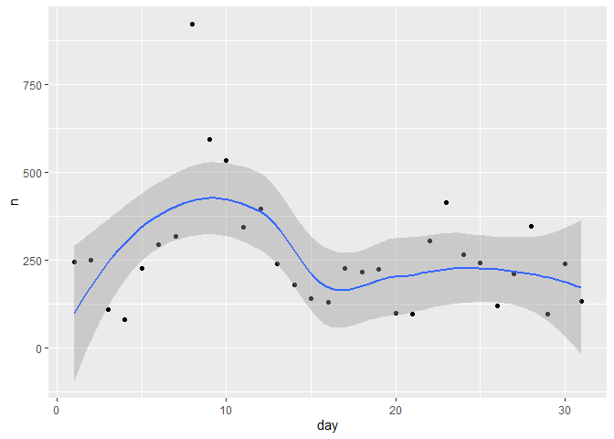<!-- -->


```r
# Investiga si la proporción de vuelos cancelados está relacionada con el retraso promedio por día en los vuelos.

mutate(flights ,cancelled=is.na(dep_time),not_cancelled=!cancelled) %>%  group_by(day) %>%  summarise(percent_cancelled=sum(cancelled,na.rm=TRUE)/(sum(cancelled,na.rm=TRUE)+sum(not_cancelled,na.rm=TRUE))*100,mean_delay=mean(dep_delay,na.rm=TRUE))-> aux

aux %>% ggplot(aes(x=percent_cancelled,y=mean_delay,color=day))+geom_point(shape=19)+geom_smooth()+coord_flip()
```

```
## `geom_smooth()` using method = 'loess' and formula 'y ~ x'
```

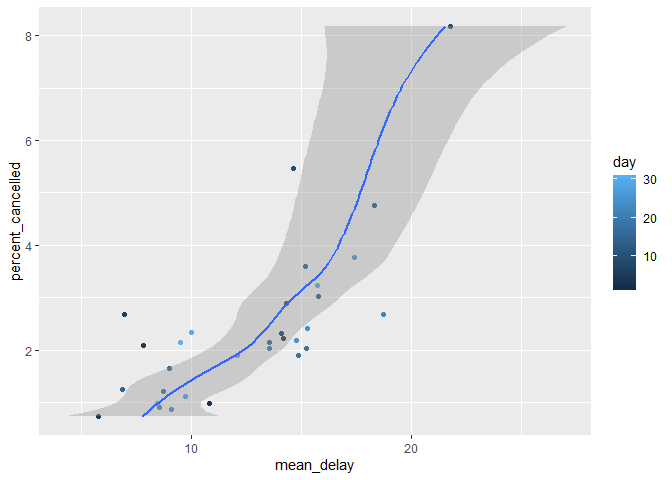<!-- -->

```r
summary(lm(aux$mean_delay~aux$percent_cancelled))
```

```
## 
## Call:
## lm(formula = aux$mean_delay ~ aux$percent_cancelled)
## 
## Residuals:
##     Min      1Q  Median      3Q     Max 
## -6.0717 -1.9737  0.5104  1.8630  5.6443 
## 
## Coefficients:
##                       Estimate Std. Error t value Pr(>|t|)    
## (Intercept)             7.9076     0.9286   8.516 2.21e-09 ***
## aux$percent_cancelled   1.9258     0.3236   5.951 1.82e-06 ***
## ---
## Signif. codes:  0 '***' 0.001 '**' 0.01 '*' 0.05 '.' 0.1 ' ' 1
## 
## Residual standard error: 2.717 on 29 degrees of freedom
## Multiple R-squared:  0.5498,	Adjusted R-squared:  0.5342 
## F-statistic: 35.41 on 1 and 29 DF,  p-value: 1.823e-06
```

### Cuestión 5.
Difícil: Intenta desentrañar los efectos que producen los retrasos por culpa de malos aeropuertos vs malas compañías aéreas. Por ejemplo, intenta usar 


```r
flights %>% group_by(carrier, dest) %>% summarise(n())
```

```
## `summarise()` has grouped output by 'carrier'. You can override using the `.groups` argument.
```

```
## # A tibble: 314 x 3
## # Groups:   carrier [16]
##    carrier dest  `n()`
##    <chr>   <chr> <int>
##  1 9E      ATL      59
##  2 9E      AUS       2
##  3 9E      AVL      10
##  4 9E      BGR       1
##  5 9E      BNA     474
##  6 9E      BOS     914
##  7 9E      BTV       2
##  8 9E      BUF     833
##  9 9E      BWI     856
## 10 9E      CAE       3
## # ... with 304 more rows
```

#### Solución


```r
flights %>% filter(!is.na(dep_delay)&dep_delay>0)%>%group_by(carrier, dest) %>% summarise(abs_freq=n(),mean=mean(dep_delay),median=median(dep_delay),IQR=IQR(dep_delay),min=min(dep_delay),max=max(dep_delay),Q25=quantile(dep_delay,0.25),Q75=quantile(dep_delay,0.75))%>% arrange(desc(median))%>% filter(abs_freq>20)-> aux
```

```
## `summarise()` has grouped output by 'carrier'. You can override using the `.groups` argument.
```


```r
ggplot(aux, aes(x = carrier, y = dest,fill=median)) +
  geom_tile() +
  scale_fill_gradientn(name = "", colors = terrain.colors(10)) +
  scale_x_discrete(name = "") +
  scale_y_discrete(name = "")
```

<!-- -->


```r
flights %>% group_by(carrier, dest) %>% summarise(abs_freq=n())%>% arrange(desc(abs_freq))-> aux
```

```
## `summarise()` has grouped output by 'carrier'. You can override using the `.groups` argument.
```

```r
aux
```

```
## # A tibble: 314 x 3
## # Groups:   carrier [16]
##    carrier dest  abs_freq
##    <chr>   <chr>    <int>
##  1 DL      ATL      10571
##  2 US      CLT       8632
##  3 AA      DFW       7257
##  4 AA      MIA       7234
##  5 UA      ORD       6984
##  6 UA      IAH       6924
##  7 UA      SFO       6819
##  8 B6      FLL       6563
##  9 B6      MCO       6472
## 10 AA      ORD       6059
## # ... with 304 more rows
```

```r
ggplot(aux, aes(x = carrier, y = dest),fill=abs_freq) +
  geom_tile() +
  scale_fill_gradientn(name = "", colors = terrain.colors(10)) +
  scale_x_discrete(name = "") +
  scale_y_discrete(name = "")
```

<!-- -->


```r
ggplot(aux, aes(x = carrier, y = dest)) +
  geom_tile() +
  scale_fill_gradientn(name = "", colors = terrain.colors(10)) +
  scale_x_discrete(name = "") +
  scale_y_discrete(name = "")
```

<!-- -->


### Cuestión 6.
¿Qué hace el parámetro sort como argumento de `count()`? ¿Cuando puede sernos útil?

Vuelve a la lista de funciones útiles para filtrar y mutar y describe cómo cada operación cambia cuando la juntamos con un `group_by`.


#### Solución

```
ggplot(aux, aes(x=carrier, y=dest, group=carrier)) + 
geom_col("abs_freq", position='dodge')
```


### Cuestión 11.7.
Vamos a por los peores aviones. Investiga el top 10 de qué aviones (número de cola y compañía) llegaron más tarde a su destino.

#### Solución


```r
flights %>% transmute(tailnum,carrier,arr_delay)%>% arrange(desc(arr_delay))%>% slice(1:10)
```

```
## # A tibble: 10 x 3
##    tailnum carrier arr_delay
##    <chr>   <chr>       <dbl>
##  1 N384HA  HA           1272
##  2 N504MQ  MQ           1127
##  3 N517MQ  MQ           1109
##  4 N338AA  AA           1007
##  5 N665MQ  MQ            989
##  6 N959DL  DL            931
##  7 N927DA  DL            915
##  8 N6716C  DL            895
##  9 N5DMAA  AA            878
## 10 N523MQ  MQ            875
```


### Cuestión 7.
Queremos saber qué hora del día nos conviene volar si queremos evitar los retrasos en la salida.

Difícil: Queremos saber qué día de la semana nos conviene volar si queremos evitar los retrasos en la salida.


#### Solución

Atención solo cogemos los retrasos positivos.


```r
# horas del día con menos retraso: he decidido filtrar por un umbral y dibujar los diagramas de caja
umbral=30# 30 minutos
flights %>%  transmute(hour=as.factor(hour),dep_delay) %>% filter(!is.na(dep_delay)&dep_delay>umbral) %>% ggplot(aes(x=hour,y=dep_delay)) + geom_boxplot()
```

<!-- -->

También podemos calcular la media de los retrasos positivos por hora


```r
flights %>% transmute(hour,dep_delay) %>% filter(!is.na(dep_delay) & dep_delay>0) %>% group_by(hour) %>% 
  summarise(mean=mean(dep_delay),median=median(dep_delay),standar_dev=sd(dep_delay),IQR=IQR(dep_delay),min=min(dep_delay),max=max(dep_delay),Q0.25=quantile(dep_delay,0.25),Q0.75=quantile(dep_delay,0.75))-> positive_dep_delay_by_hour
positive_dep_delay_by_hour
```

```
## # A tibble: 19 x 9
##     hour  mean median standar_dev   IQR   min   max Q0.25 Q0.75
##    <dbl> <dbl>  <dbl>       <dbl> <dbl> <dbl> <dbl> <dbl> <dbl>
##  1     5  15.3    6          26.4    12     1   201     3    15
##  2     6  24.2    9          44.0    21     1   786     3    24
##  3     7  24.1    9          42.8    23     1   898     3    26
##  4     8  29.9   13          49.7    29     1   911     4    33
##  5     9  29.7   13          50.2    30     1  1301     4    34
##  6    10  32.6   13          52.6    33     1   788     5    38
##  7    11  32.5   15          48.0    34     1   437     5    39
##  8    12  32.3   16          46.8    35     1   636     5    40
##  9    13  33.5   16          47.4    34     1   634     6    40
## 10    14  37.1   17          53.0    40     1   602     6    46
## 11    15  38.8   19          52.8    42     1   483     7    49
## 12    16  43.4   22          58.1    49     1  1126     8    57
## 13    17  45.3   23          60.6    51     1   896     8    59
## 14    18  46.5   25          59.5    53     1  1014     8    61
## 15    19  51.1   29          61.8    60     1  1137    10    70
## 16    20  49.6   30          54.8    58     1   878    11    69
## 17    21  50.3   34          51.3    60     1   800    12    72
## 18    22  46.5   31.5        46.1    56     1   276    12    68
## 19    23  38.0   22          42.1    44     1   245     8    52
```
 Hay que utilizar el package lubridate para extraer el día de la semana


```r
library(lubridate)
flights$time_hour[1:2]
```

```
## [1] "2013-01-01 05:00:00 EST" "2013-01-01 05:00:00 EST"
```

```r
wday(flights$time_hour[1:2])
```

```
## [1] 3 3
```

```r
Sys.Date()
```

```
## [1] "2021-10-08"
```

```r
wday(Sys.Date())
```

```
## [1] 6
```

```r
wday(Sys.Date(),week_start = getOption("lubridate.week.start", 1))
```

```
## [1] 5
```

```r
wday(Sys.Date(),label=TRUE,week_start = getOption("lubridate.week.start", 1))
```

```
## [1] vi\\.
## Levels: lu\\. < ma\\. < mi\\. < ju\\. < vi\\. < sá\\. < do\\.
```

```r
flights %>% transmute(day=wday(time_hour,label=TRUE,week_start = getOption("lubridate.week.start", 1)),dep_delay) %>%
filter(!is.na(dep_delay)&dep_delay>0) %>% group_by(day)%>%    summarise(mean=mean(dep_delay),median=median(dep_delay),standar_dev=sd(dep_delay),IQR=IQR(dep_delay),min=min(dep_delay),max=max(dep_delay),Q0.25=quantile(dep_delay,0.25),Q0.75=quantile(dep_delay,0.75))-> positive_dep_delay_by_week_day
positive_dep_delay_by_week_day
```

```
## # A tibble: 7 x 9
##   day      mean median standar_dev   IQR   min   max Q0.25 Q0.75
##   <ord>   <dbl>  <dbl>       <dbl> <dbl> <dbl> <dbl> <dbl> <dbl>
## 1 "lu\\."  43.5     21        57.6    50     1  1005     7    57
## 2 "ma\\."  37.4     19        49.0    44     1   853     6    50
## 3 "mi\\."  39.5     18        56.0    43     1  1301     6    49
## 4 "ju\\."  43.1     21        58.2    49     1  1126     7    56
## 5 "vi\\."  40.4     20        54.3    46     1  1014     7    53
## 6 "sá\\."  30.5     14        45.7    31     1  1137     5    36
## 7 "do\\."  37.5     18        54.0    40     1   911     6    46
```


### Cuestión 8
Para cada destino, calcula el total de minutos de retraso acumulado.
Para cada uno de ellos, calcula la proporción del total de retraso para dicho destino.


#### Solución


```r
flights %>% transmute(dest,dep_delay)%>% filter(dep_delay>0)%>%group_by(dest) %>%
  summarise(sum=sum(dep_delay,na.rm=TRUE))%>%
  mutate(prop_delay=sum/sum(sum))%>% arrange(sum)-> aux
```


### Cuestión 9
Los retrasos suelen estar correlacionados con el tiempo. Aunque el problema que ha causado el primer retraso de un avión se resuelva, el resto de vuelos se retrasan para que salgan primero los aviones que debían haber partido antes. Intenta usar la función `lag()` explora cómo el retraso de un avión se relaciona con el retraso del avión inmediatamente anterior o posterior.

### Solución

Seleccionaremos las salidas de JFK  y los retrasos en la salida. Necesitamos ordenar los vuelos por salida 


```r
flights%>% filter(origin=="JFK") %>% transmute(origin, time_hour,dep_delay) %>% arrange(time_hour)-> flights_time_order
lapply(1:10,function(x) cor(flights_time_order$dep_delay,lag(flights_time_order$dep_delay,x),use="complete.obs")) -> correlation_delay_lag
correlation_delay_lag<- unlist(correlation_delay_lag)
names(correlation_delay_lag)<-paste("lag",1:10,sep="_")
correlation_delay_lag
```

```
##      lag_1      lag_2      lag_3      lag_4      lag_5      lag_6      lag_7 
## 0.55227212 0.38265103 0.28005542 0.21765785 0.17309678 0.14035150 0.11570897 
##      lag_8      lag_9     lag_10 
## 0.09918925 0.09461354 0.08716629
```

Vemos como las correlaciones entre los retrasos decrecen

### Cuestión 10.
Vamos a por los destinos esta vez. Localiza vuelos que llegaron 'demasiado rápido' a sus destinos. Seguramente, el becario se equivocó al introducir el tiempo de vuelo y se trate de un error en los datos. Calcula para ello el cociente entre el tiempo en el aire de cada vuelo relativo al tiempo de vuelo del avión que tardó menos en llegar a dicho destino. ¿Qué vuelos fueron los que más se retrasaron en el aire?

#### Solución


```r
flights %>% filter(origin=="JFK",!is.na(air_time))  -> JFK_fli
JFK_fli %>% right_join( JFK_fli %>% group_by(dest) %>% summarise(min_air_time=min(air_time),key="dest")) %>%
  transmute(dest,tailnum,carrier,sched_dep_time,sched_arr_time,air_time, min_air_time,rel_air_time_by_dest=air_time/min_air_time) %>% arrange(desc(rel_air_time_by_dest))-> JFK_fli 
```

```
## Joining, by = "dest"
```

```r
JFK_fli
```

```
## # A tibble: 109,079 x 8
##    dest  tailnum carrier sched_dep_time sched_arr_time air_time min_air_time
##    <chr> <chr>   <chr>            <int>          <int>    <dbl>        <dbl>
##  1 ACK   N328JB  B6                 800            909      141           35
##  2 BOS   N3FKAA  AA                1605           1740       96           26
##  3 BOS   N346NB  DL                1200           1317       91           26
##  4 BOS   N913XJ  9E                 840           1003       86           26
##  5 BOS   N3DRAA  AA                1245           1355       86           26
##  6 BOS   N3FEAA  AA                1245           1350       80           26
##  7 BOS   N279JB  B6                1645           1813       77           26
##  8 BOS   N3FJAA  AA                1600           1720       76           26
##  9 PHL   N8932C  9E                 940           1051       61           21
## 10 DCA   N813MQ  MQ                 755            910       97           34
## # ... with 109,069 more rows, and 1 more variable: rel_air_time_by_dest <dbl>
```

Los vuelos a los aeropuertos con más retraso relativo son de los aeropuertos 


```r
airports[airports$faa %in% c("ACK","BOS","DCA"),]
```

```
## # A tibble: 3 x 8
##   faa   name                           lat   lon   alt    tz dst   tzone        
##   <chr> <chr>                        <dbl> <dbl> <dbl> <dbl> <chr> <chr>        
## 1 ACK   Nantucket Mem                 41.3 -70.1    48    -5 A     America/New_~
## 2 BOS   General Edward Lawrence Log~  42.4 -71.0    19    -5 A     America/New_~
## 3 DCA   Ronald Reagan Washington Na~  38.9 -77.0    15    -5 A     America/New_~
```
Un gráfico   de los tiempos relativos  contra los absolutos (no interpretéis mucho las rectas pues lo son y=x/min), el gráfico es mejorable.


```r
JFK_fli %>% ggplot(aes(x=air_time,y=rel_air_time_by_dest))+ geom_point(aes(col=dest))
```

<!-- -->


```r
JFK_fli %>% filter(dest=="BOS")%>%
 ggplot(aes(x=air_time,y=rel_air_time_by_dest))+ geom_point()
```

<!-- -->


### Cuestión 11.
Encuentra todos los destinos a los que vuelan dos o más compañías y para cada uno de ellos, crea un ranking de las mejores compañías para volar a cada destino (utiliza el criterio que consideres más conveniente como probabilidad de retraso, velocidad o tiempo de vuelo, número de vuelos al año..)

Finalmente, para cada avión (basándonos en el número de cola) cuenta el número de vuelos que hace antes de sufrir su primer retraso de más de una hora. Valora entonces la fiabilidad del avión o de la compañía aérea asociada al mismo.

#### Solución


```r
flights %>% group_by(dest, carrier) %>% count() %>% filter(n >= 2) -> aux
filter_dest_carrier = paste(aux$dest, aux$carrier)
filter_dest_carrier
```

```
##   [1] "ABQ B6" "ACK B6" "ALB EV" "ANC UA" "ATL 9E" "ATL DL" "ATL EV" "ATL FL"
##   [9] "ATL MQ" "ATL UA" "ATL WN" "AUS 9E" "AUS AA" "AUS B6" "AUS DL" "AUS UA"
##  [17] "AUS WN" "AVL 9E" "AVL EV" "BDL EV" "BDL UA" "BGR EV" "BHM EV" "BNA 9E"
##  [25] "BNA EV" "BNA MQ" "BNA WN" "BOS 9E" "BOS AA" "BOS B6" "BOS DL" "BOS EV"
##  [33] "BOS UA" "BOS US" "BQN B6" "BQN UA" "BTV 9E" "BTV B6" "BTV EV" "BUF 9E"
##  [41] "BUF B6" "BUF DL" "BUF EV" "BUR B6" "BWI 9E" "BWI EV" "BWI MQ" "BWI WN"
##  [49] "BZN UA" "CAE 9E" "CAE EV" "CAK FL" "CHO EV" "CHS 9E" "CHS B6" "CHS EV"
##  [57] "CLE 9E" "CLE EV" "CLE MQ" "CLE OO" "CLE UA" "CLT 9E" "CLT B6" "CLT EV"
##  [65] "CLT MQ" "CLT UA" "CLT US" "CLT YV" "CMH 9E" "CMH EV" "CMH MQ" "CRW MQ"
##  [73] "CVG 9E" "CVG DL" "CVG EV" "CVG MQ" "DAY 9E" "DAY EV" "DCA 9E" "DCA DL"
##  [81] "DCA EV" "DCA MQ" "DCA UA" "DCA US" "DEN B6" "DEN DL" "DEN F9" "DEN UA"
##  [89] "DEN WN" "DFW 9E" "DFW AA" "DFW EV" "DFW UA" "DSM 9E" "DSM EV" "DTW 9E"
##  [97] "DTW DL" "DTW EV" "DTW MQ" "DTW OO" "EGE AA" "EGE UA" "EYW DL" "FLL AA"
## [105] "FLL B6" "FLL DL" "FLL UA" "GRR 9E" "GRR EV" "GSO EV" "GSP 9E" "GSP EV"
## [113] "HDN UA" "HNL HA" "HNL UA" "HOU B6" "HOU WN" "IAD 9E" "IAD B6" "IAD EV"
## [121] "IAD YV" "IAH AA" "IAH UA" "ILM EV" "IND 9E" "IND DL" "IND EV" "IND MQ"
## [129] "IND UA" "JAC DL" "JAC UA" "JAX 9E" "JAX B6" "JAX EV" "LAS AA" "LAS B6"
## [137] "LAS DL" "LAS UA" "LAS VX" "LAX AA" "LAX B6" "LAX DL" "LAX UA" "LAX VX"
## [145] "LGB B6" "MCI 9E" "MCI DL" "MCI EV" "MCO AA" "MCO B6" "MCO DL" "MCO UA"
## [153] "MDW WN" "MEM 9E" "MEM DL" "MEM EV" "MHT 9E" "MHT EV" "MIA AA" "MIA DL"
## [161] "MIA UA" "MKE 9E" "MKE EV" "MKE FL" "MKE WN" "MSN EV" "MSP 9E" "MSP DL"
## [169] "MSP EV" "MSP MQ" "MSP OO" "MSP UA" "MSY 9E" "MSY B6" "MSY DL" "MSY EV"
## [177] "MSY UA" "MSY WN" "MTJ UA" "MVY 9E" "MVY B6" "MYR EV" "OAK B6" "OKC EV"
## [185] "OMA EV" "OMA UA" "ORD 9E" "ORD AA" "ORD B6" "ORD EV" "ORD MQ" "ORD UA"
## [193] "ORF 9E" "ORF EV" "ORF MQ" "PBI AA" "PBI B6" "PBI DL" "PBI EV" "PBI UA"
## [201] "PDX B6" "PDX DL" "PDX UA" "PHL 9E" "PHL DL" "PHL EV" "PHL US" "PHL YV"
## [209] "PHX B6" "PHX DL" "PHX UA" "PHX US" "PHX WN" "PIT 9E" "PIT B6" "PIT DL"
## [217] "PIT EV" "PIT MQ" "PIT UA" "PSE B6" "PSP VX" "PVD EV" "PWM B6" "PWM DL"
## [225] "PWM EV" "RDU 9E" "RDU B6" "RDU EV" "RDU MQ" "RIC 9E" "RIC EV" "ROC 9E"
## [233] "ROC B6" "ROC EV" "RSW 9E" "RSW B6" "RSW DL" "RSW UA" "SAN AA" "SAN B6"
## [241] "SAN DL" "SAN UA" "SAT 9E" "SAT DL" "SAT UA" "SAV EV" "SBN EV" "SDF 9E"
## [249] "SDF EV" "SDF UA" "SEA AA" "SEA AS" "SEA B6" "SEA DL" "SEA UA" "SFO AA"
## [257] "SFO B6" "SFO DL" "SFO UA" "SFO VX" "SJC B6" "SJU AA" "SJU B6" "SJU DL"
## [265] "SJU UA" "SLC B6" "SLC DL" "SMF B6" "SNA UA" "SRQ 9E" "SRQ B6" "SRQ DL"
## [273] "SRQ EV" "STL AA" "STL EV" "STL MQ" "STL UA" "STL WN" "STT AA" "STT DL"
## [281] "STT UA" "SYR 9E" "SYR B6" "SYR EV" "TPA 9E" "TPA AA" "TPA B6" "TPA DL"
## [289] "TPA MQ" "TPA UA" "TUL EV" "TVC EV" "TVC MQ" "TYS 9E" "TYS EV" "XNA EV"
## [297] "XNA MQ"
```

```r
flights %>% filter(paste(dest, carrier) %in% filter_dest_carrier &
                     !is.na(arr_delay)) %>%
  transmute(dest, carrier, arr_delay, flights_delayeds = arr_delay >= 5) %>% group_by(dest, carrier) %>%
  summarise(
    total_flights = n(),
    total_flights_delayeds = sum(flights_delayeds),
    percent_flights_delayeds = 100 * total_flights_delayeds / total_flights
  ) %>% arrange(percent_flights_delayeds, total_flights) %>% print( n =20)
```

```
## `summarise()` has grouped output by 'dest'. You can override using the `.groups` argument.
```

```
## # A tibble: 297 x 5
## # Groups:   dest [103]
##    dest  carrier total_flights total_flights_delayeds percent_flights_delayeds
##    <chr> <chr>           <int>                  <int>                    <dbl>
##  1 BTV   9E                  2                      0                     0   
##  2 DCA   DL                  2                      0                     0   
##  3 IND   DL                  2                      0                     0   
##  4 MSP   UA                  2                      0                     0   
##  5 OMA   UA                  2                      0                     0   
##  6 PHL   DL                  2                      0                     0   
##  7 BUF   DL                  3                      0                     0   
##  8 IND   UA                  3                      0                     0   
##  9 MEM   9E                  3                      0                     0   
## 10 SDF   UA                  3                      0                     0   
## 11 TPA   9E                  3                      0                     0   
## 12 MHT   9E                 10                      0                     0   
## 13 STT   DL                 29                      1                     3.45
## 14 DFW   EV                  8                      1                    12.5 
## 15 PBI   AA                 80                     11                    13.8 
## 16 AUS   WN                293                     42                    14.3 
## 17 PSP   VX                 18                      3                    16.7 
## 18 SRQ   EV                 28                      5                    17.9 
## 19 BOS   EV                156                     29                    18.6 
## 20 AVL   9E                 10                      2                    20   
## # ... with 277 more rows
```


#  Análisis exploratorio de nuestros datos: 

## Introducción a la exploración de datos. 

Intenta hacer los análisis de forma tan detallada como te sea posible, generando preguntas con sentido y intentando obtener una respuesta coherente.

Preguntas de esta tarea

### Cuestión 1.
Explora la distribución de las variables `x`, `y`, `z` del dataset de `diamonds`. ¿Qué podemos inferir?

Busca un diamante (por internet por ejemplo) y decide qué dimensiones pueden ser aceptables para las medidas de longitud, altura y anchura de un diamante.

### Cuestión 2.
Explora la distribución del precio (`price`) del dataset de `diamonds`. ¿Hay algo que te llame la atención o resulte un poco extraño?

Recuerda hacer uso del parámetro `binwidth` para probar un rango dispar de valores hasta ver algo que te llame la atención.

### Cuestión 3.
¿Cuantos diamantes hay de 0.99 quilates? ¿Y de exactamente 1 quilate?

¿A qué puede ser debida esta diferencia?

### Cuestión 4.
Compara y contrasta el uso de las funciones `coord_cartesian()` frente `xlim()` y `ylim()` para hacer *zoom* en un histograma.

¿Qué ocurre si dejamos el parámetro `binwidth` sin configurar?

¿Qué ocurre si hacemos *zoom* y solamente se ve media barra?

### Cuestión 5.
* ¿Qué ocurre cuando hay NAs en un histograma? 
* ¿Qué ocurre cuando hay NAs en un diagrama de barras?
* ¿Qué diferencias observas?

### Cuestión .6.
¿Qué hace la opción  `na.rm = TRUE` en las funciones `mean()` y `sum()`?


## Visualización de la covarianza entre variables.  

Repasa todo lo aprendido acerca de boxplots, densidades, mapas de calor... porque es hora de extraer más información acerca de los datos de nuestros datasets.

Preguntas de esta tarea

### Cuestión 1.
Es hora de aplicar todo lo que hemos aprendido para visualizar mejor los tiempos de salida para vuelos cancelados vs los no cancelados. Recuerda bien qué tipo de dato tenemos en cada caso. ¿Qué deduces acerca de los retrasos según la hora del día a la que está programada el vuelo de salida?

### Cuestión 2.
1. ¿Qué variable del dataset de diamantes crees que es la más importante para poder predecir el precio de un diamante?
2. ¿Qué variable del dataset de diamantes crees que es la que más correlacionada está con cut?
3. ¿Por qué combinar estas dos variables nos lleva a que los diamantes con peor calidad son los mas caros?

### Cuestión 3.
Instala el paquete de ggstance y úsalo para crear un boxplot horizontal. Compara el resultado con usar el coord_flip() que hemos visto en clase.

### Cuestión 4.
Los boxplots nacen en una época donde los datasets eran mucho más pequeños y la palabra big data no era más que un concepto futurista. De ahí que los datos considerados con outliers tuvieran sentido que fueran representados con puntos dado que su existencia era más bien escasa o nula. Para solucionar este problema, existe el letter value plot del paquete lvplot. Instala dicho paquete y usa la geometría geom_lv() para mostrar la distribución de precio vs cut de los diamantes. ¿Qué observas y qué puedes interpretar a raíz de dicho gráfico?

### Cuestión 5.
Compara el uso de la geometría geom_violin() con un facet de geom_histogram() y contra un geom_freqpoly() coloreado. Investiga cuales son los pros y los contras de cada uno de los tipos de representación.

### Cuestión 6.
Si tenemos datasets pequeños, a veces es útil usar la opción que ya conocemos de geom_jitter() para ver la relación entre una variable continua y una variable categórica. El paquete de R ggbeeswarm tiene un par de métodos similares a geom_jitter() que te pueden ayudar a tal efecto. Lístalos y haz un gráfico con cada uno de ellos para ver qué descripción de los datos podemos extraer de cada uno. ¿A qué gráfico de los que ya has visto durante esta práctica se parece?

### Cuestión 7.
Los mapas de calor que hemos visto tienen un claro problema de elección de los colores. 

    * ¿Cómo podríamos reescalar el campo count dataset de diamantes cuando cruzamos color y cut para observar mejor la distribución de dicho cruce?
    * ¿Por qué resulta mejor usar la estética aes(x = color, y = cut) en lugar de aes(x=cut, y = color)?

### Cuestión 8.
Utiliza la geom_tile() junto con dplyr para explorar si el promedio del retraso de los vuelos varía con respecto al destino y mes del año. 

*¿Qué hace que este gráfico sea difícil de leer o de interpretar?
*¿Cómo puedes mejorar la visualización?

### Cuestión 9.
En lugar de hacer un resumen de la distribución condicional de dos variables numéricas con un boxplot, se puede usar un polígono de frecuencias. 

* ¿Qué hay que tener en cuenta cuando usas cut_width o cuando usas cut_number()?
* ¿Cómo influye este hecho en la visualización 2D de carat y price
* Da la mejor visualización posible de carat dividido por price.

### Cuestión 10.
Compara la distribución del precio de los diamantes grandes vs diamantes pequeños. Elige el concepto de grande y pequeño que consideres. Comenta el resultado.

### Cuestión 11.
Combina diferentes técnicas de ggplot para visualizar la distribución combinada de cut, carat y precio.

### Cuestión 12.
Los plots en 2D pueden revelar outliers que no se ven en plots de una sola dimensión. Por ejemplo, algunos puntos del plot dado por

```
ggplot(data = diamonds) + 
  geom_point(mapping = aes(x = x, y = y)) + 
  coord_cartesian(xlim = c(4,12), ylim = c(4,12))
```
hacen destacar muchísimo los outliers combinando x con y, a pesar de que por separado parecen valores normales. 

Intenta averiguar porqué un scatterplot resulta más efectivo en este caso que un gráfico con agrupaciones.


# Enunciado taller 
Consideremos las siguiente preguntas relacionadas con  el data set `flights` 


### Cuestión 1

Los retrasos suelen estar correlacionados con el tiempo. Aunque el problema que ha causado el primer retraso de un avión se resuelva, el resto de vuelos se retrasan para que salgan primero los aviones que debían haber partido antes. Intenta usar la función `lag()` explora cómo el retraso de un avión se relaciona con el retraso del avión inmediatamente anterior o posterior.

### Solución

Seleccionaremos las salidas de JFK  y los retrasos en la salida. Necesitamos ordenar los vuelos por salida 

```r
flights %>% filter(origin == "JFK") %>%
  transmute(origin, time_hour, dep_delay) %>%
  arrange(time_hour) -> flights_time_order
  
  
  lapply(1:10, function(x)
  cor(
  flights_time_order$dep_delay,
  lag(flights_time_order$dep_delay, x),
  use = "complete.obs"
  )) -> correlation_delay_lag
  
  correlation_delay_lag <- unlist(correlation_delay_lag)
  names(correlation_delay_lag) <- paste("lag", 1:10, sep = "_")
  correlation_delay_lag
```

```
##      lag_1      lag_2      lag_3      lag_4      lag_5      lag_6      lag_7 
## 0.55227212 0.38265103 0.28005542 0.21765785 0.17309678 0.14035150 0.11570897 
##      lag_8      lag_9     lag_10 
## 0.09918925 0.09461354 0.08716629
```


Vemos como las correlaciones entre los retrasos decrecen

### Cuestión 2
Vamos a por los destinos esta vez. Localiza vuelos que llegaron 'demasiado rápido' a sus destinos. Seguramente, el becario se equivocó al introducir el tiempo de vuelo y se trate de un error en los datos. Calcula para ello el cociente entre el tiempo en el aire de cada vuelo relativo al tiempo de vuelo del avión que tardó menos en llegar a dicho destino. ¿Qué vuelos fueron los que más se retrasaron en el aire?

### Solución


```r
flights %>% filter(origin=="JFK",!is.na(air_time))  -> JFK_fli

JFK_fli %>% right_join( JFK_fli %>% group_by(dest) %>%
                          summarise(min_air_time=min(air_time),key="dest")) %>%
  transmute(dest,tailnum,carrier,sched_dep_time,sched_arr_time,air_time,
            min_air_time,rel_air_time_by_dest=air_time/min_air_time) %>%
  arrange(desc(rel_air_time_by_dest))-> JFK_fli 
```

```
## Joining, by = "dest"
```

```r
JFK_fli
```

```
## # A tibble: 109,079 x 8
##    dest  tailnum carrier sched_dep_time sched_arr_time air_time min_air_time
##    <chr> <chr>   <chr>            <int>          <int>    <dbl>        <dbl>
##  1 ACK   N328JB  B6                 800            909      141           35
##  2 BOS   N3FKAA  AA                1605           1740       96           26
##  3 BOS   N346NB  DL                1200           1317       91           26
##  4 BOS   N913XJ  9E                 840           1003       86           26
##  5 BOS   N3DRAA  AA                1245           1355       86           26
##  6 BOS   N3FEAA  AA                1245           1350       80           26
##  7 BOS   N279JB  B6                1645           1813       77           26
##  8 BOS   N3FJAA  AA                1600           1720       76           26
##  9 PHL   N8932C  9E                 940           1051       61           21
## 10 DCA   N813MQ  MQ                 755            910       97           34
## # ... with 109,069 more rows, and 1 more variable: rel_air_time_by_dest <dbl>
```
Los vuelos a los aeropuertos con más retraso relativo son de los aeropuertos 


```r
airports[airports$faa %in% c("ACK","BOS","DCA"),]
```

```
## # A tibble: 3 x 8
##   faa   name                           lat   lon   alt    tz dst   tzone        
##   <chr> <chr>                        <dbl> <dbl> <dbl> <dbl> <chr> <chr>        
## 1 ACK   Nantucket Mem                 41.3 -70.1    48    -5 A     America/New_~
## 2 BOS   General Edward Lawrence Log~  42.4 -71.0    19    -5 A     America/New_~
## 3 DCA   Ronald Reagan Washington Na~  38.9 -77.0    15    -5 A     America/New_~
```
Un gráfico   de los tiempos relativos  contra los absolutos (no interpretéis mucho las rectas pues lo son y=x/min), el gráfico es mejorable.


```r
JFK_fli %>% ggplot(aes(x=air_time,y=rel_air_time_by_dest))+ geom_point(aes(col=dest))
```

<!-- -->


```r
JFK_fli %>% filter(dest=="BOS")%>%
 ggplot(aes(x=air_time,y=rel_air_time_by_dest))+ geom_point()
```

<!-- -->


### Cuestión 3
Encuentra todos los destinos a los que vuelan dos o más compañías y para cada uno de ellos, crea un ranking de las mejores compañías para volar a cada destino (utiliza el criterio que consideres más conveniente como probabilidad de retraso, velocidad o tiempo de vuelo, número de vuelos al año..)

Finalmente, para cada avión (basándonos en el número de cola) cuenta el número de vuelos que hace antes de sufrir su primer retraso de más de una hora. Valora entonces la fiabilidad del avión o de la compañía aérea asociada al mismo.

### Solución


```r
flights %>% group_by(dest, carrier) %>% count() %>% filter(n >= 2) -> aux

filter_dest_carrier = paste(aux$dest, aux$carrier)
filter_dest_carrier
```

```
##   [1] "ABQ B6" "ACK B6" "ALB EV" "ANC UA" "ATL 9E" "ATL DL" "ATL EV" "ATL FL"
##   [9] "ATL MQ" "ATL UA" "ATL WN" "AUS 9E" "AUS AA" "AUS B6" "AUS DL" "AUS UA"
##  [17] "AUS WN" "AVL 9E" "AVL EV" "BDL EV" "BDL UA" "BGR EV" "BHM EV" "BNA 9E"
##  [25] "BNA EV" "BNA MQ" "BNA WN" "BOS 9E" "BOS AA" "BOS B6" "BOS DL" "BOS EV"
##  [33] "BOS UA" "BOS US" "BQN B6" "BQN UA" "BTV 9E" "BTV B6" "BTV EV" "BUF 9E"
##  [41] "BUF B6" "BUF DL" "BUF EV" "BUR B6" "BWI 9E" "BWI EV" "BWI MQ" "BWI WN"
##  [49] "BZN UA" "CAE 9E" "CAE EV" "CAK FL" "CHO EV" "CHS 9E" "CHS B6" "CHS EV"
##  [57] "CLE 9E" "CLE EV" "CLE MQ" "CLE OO" "CLE UA" "CLT 9E" "CLT B6" "CLT EV"
##  [65] "CLT MQ" "CLT UA" "CLT US" "CLT YV" "CMH 9E" "CMH EV" "CMH MQ" "CRW MQ"
##  [73] "CVG 9E" "CVG DL" "CVG EV" "CVG MQ" "DAY 9E" "DAY EV" "DCA 9E" "DCA DL"
##  [81] "DCA EV" "DCA MQ" "DCA UA" "DCA US" "DEN B6" "DEN DL" "DEN F9" "DEN UA"
##  [89] "DEN WN" "DFW 9E" "DFW AA" "DFW EV" "DFW UA" "DSM 9E" "DSM EV" "DTW 9E"
##  [97] "DTW DL" "DTW EV" "DTW MQ" "DTW OO" "EGE AA" "EGE UA" "EYW DL" "FLL AA"
## [105] "FLL B6" "FLL DL" "FLL UA" "GRR 9E" "GRR EV" "GSO EV" "GSP 9E" "GSP EV"
## [113] "HDN UA" "HNL HA" "HNL UA" "HOU B6" "HOU WN" "IAD 9E" "IAD B6" "IAD EV"
## [121] "IAD YV" "IAH AA" "IAH UA" "ILM EV" "IND 9E" "IND DL" "IND EV" "IND MQ"
## [129] "IND UA" "JAC DL" "JAC UA" "JAX 9E" "JAX B6" "JAX EV" "LAS AA" "LAS B6"
## [137] "LAS DL" "LAS UA" "LAS VX" "LAX AA" "LAX B6" "LAX DL" "LAX UA" "LAX VX"
## [145] "LGB B6" "MCI 9E" "MCI DL" "MCI EV" "MCO AA" "MCO B6" "MCO DL" "MCO UA"
## [153] "MDW WN" "MEM 9E" "MEM DL" "MEM EV" "MHT 9E" "MHT EV" "MIA AA" "MIA DL"
## [161] "MIA UA" "MKE 9E" "MKE EV" "MKE FL" "MKE WN" "MSN EV" "MSP 9E" "MSP DL"
## [169] "MSP EV" "MSP MQ" "MSP OO" "MSP UA" "MSY 9E" "MSY B6" "MSY DL" "MSY EV"
## [177] "MSY UA" "MSY WN" "MTJ UA" "MVY 9E" "MVY B6" "MYR EV" "OAK B6" "OKC EV"
## [185] "OMA EV" "OMA UA" "ORD 9E" "ORD AA" "ORD B6" "ORD EV" "ORD MQ" "ORD UA"
## [193] "ORF 9E" "ORF EV" "ORF MQ" "PBI AA" "PBI B6" "PBI DL" "PBI EV" "PBI UA"
## [201] "PDX B6" "PDX DL" "PDX UA" "PHL 9E" "PHL DL" "PHL EV" "PHL US" "PHL YV"
## [209] "PHX B6" "PHX DL" "PHX UA" "PHX US" "PHX WN" "PIT 9E" "PIT B6" "PIT DL"
## [217] "PIT EV" "PIT MQ" "PIT UA" "PSE B6" "PSP VX" "PVD EV" "PWM B6" "PWM DL"
## [225] "PWM EV" "RDU 9E" "RDU B6" "RDU EV" "RDU MQ" "RIC 9E" "RIC EV" "ROC 9E"
## [233] "ROC B6" "ROC EV" "RSW 9E" "RSW B6" "RSW DL" "RSW UA" "SAN AA" "SAN B6"
## [241] "SAN DL" "SAN UA" "SAT 9E" "SAT DL" "SAT UA" "SAV EV" "SBN EV" "SDF 9E"
## [249] "SDF EV" "SDF UA" "SEA AA" "SEA AS" "SEA B6" "SEA DL" "SEA UA" "SFO AA"
## [257] "SFO B6" "SFO DL" "SFO UA" "SFO VX" "SJC B6" "SJU AA" "SJU B6" "SJU DL"
## [265] "SJU UA" "SLC B6" "SLC DL" "SMF B6" "SNA UA" "SRQ 9E" "SRQ B6" "SRQ DL"
## [273] "SRQ EV" "STL AA" "STL EV" "STL MQ" "STL UA" "STL WN" "STT AA" "STT DL"
## [281] "STT UA" "SYR 9E" "SYR B6" "SYR EV" "TPA 9E" "TPA AA" "TPA B6" "TPA DL"
## [289] "TPA MQ" "TPA UA" "TUL EV" "TVC EV" "TVC MQ" "TYS 9E" "TYS EV" "XNA EV"
## [297] "XNA MQ"
```

```r
flights %>% filter(paste(dest, carrier)%in%
                     filter_dest_carrier&!is.na(arr_delay)) %>%
  transmute(dest, carrier, arr_delay, flights_delayeds = arr_delay >= 5)%>%
  group_by(dest, carrier) %>%
  summarise(
    total_flights = n(),
    total_flights_delayeds = sum(flights_delayeds),
    percent_flights_delayeds = 100 * total_flights_delayeds / total_flights
  ) %>%
  arrange(percent_flights_delayeds, total_flights) %>%
  print(pp, n = 20, width = 5)
```

```
## `summarise()` has grouped output by 'dest'. You can override using the `.groups` argument.
```

```
## # A
## #   tibble:
## #   297
## #   x
## #   5
## # Groups:  
## #   dest
## #   [103]
## # ...
## #   with
## #   277
## #   more
## #   rows,
## #   and
## #   5
## #   more
## #   variables:
## #   dest <chr>,
## #   carrier <chr>,
## #   total_flights <int>,
## #   total_flights_delayeds <int>,
## #   percent_flights_delayeds <dbl>
```

# Preguntas

Entregad en un fichero Rmd y html  (y subirlos a la actividad correspondiente) que responda estas preguntas:

## Pregunta 1 
Para las cada una de las tres cuestiones:

1. Comentar qué hace cada línea de código. (5 puntos)
2. Utilizar las salidas del código para responder a la cuestión o justificar que no es posible responder a la cuestión planteada. (2 puntos)

## Pregunta 2 
Para las cada una de las tres cuestiones introducid alguna mejora en el el código que mejore total o parcialmente las soluciones de las tres cuestiones propuestas. (3 puntos/ uno por cada cuestión.)  

# Emisiones de CO2 en el mundo.


El siguiente enlace [WorldBankCO2](https://mkt.tableau.com/Public/Datasets/World_Bank_CO2.xlsx)
nos da acceso a un conocido data set  de [THE WORLD BANK](https://datacatalog.worldbank.org/). En concreto  la versión de este data set es la de de [Tableau Open Data Sets](https://www.tableau.com/learn/articles/free-public-data-sets) una colección de datos del programa [Tableau](https://public.tableau.com/en-us/s/gallery) que es un programa para  representar gráficas, paneles de control o [_dahsboards_](https://en.wikipedia.org/wiki/Dashboard_(business)) y los llamados [KPIs](https://en.wikipedia.org/wiki/Dashboard_(business)). 

En esta actividad se trata en primer lugar que entendáis  los datos del fichero y que lo leáis de forma directa desde el archivo .xlsx y transforméis en tibbles o data frames de R.

El fichero excel consta de 9 hojas  y podemos explorarlo y leerlo con varios paquetes de R. Uno de estos es `readr`

Por ejemplo el siguiente código nos da los nombres de las sheets del fichero


```r
library(readxl)
filename="World_Bank_CO2.xlsx"
sheets_names <- readxl::excel_sheets(filename)
sheets_names
```

```
## [1] "About"                    "CO2 (kt) Pivoted"        
## [3] "CO2 (kt) RAW DATA"        "CO2 Data Cleaned"        
## [5] "CO2 (kt) for Split"       "CO2 for World to Union"  
## [7] "CO2 Per Capita RAW DATA"  "CO2 Per Capita (Pivoted)"
## [9] "Metadata - Countries"
```

Ahora podemos leer cada hoja


```r
read_excel_allsheets <- function(filename) {
    sheets_names <- readxl::excel_sheets(filename)
    x <- lapply(sheets_names, function(X) readxl::read_excel(filename, sheet = X))
    names(x) <- sheets_names
    return(x)
    }
```


El siguiente código lee todas las sheets del excel y pone cada una en una lista de objetos llamada all_data_CO2. Cada objeto se llama con el nombre de la hoja


```r
all_data_CO2=read_excel_allsheets(filename)
class(all_data_CO2)
```

```
## [1] "list"
```

```r
lapply(all_data_CO2,FUN=function(x) c(class=paste(class(x),collapse=", "),col_names=paste(names(x),collapse=", ")))
```

```
## $About
##                                                                                                                                              class 
##                                                                                                                          "tbl_df, tbl, data.frame" 
##                                                                                                                                          col_names 
## "Data from http://data.worldbank.org/indicator/EN.ATM.CO2E.PC and http://data.worldbank.org/indicator/EN.ATM.CO2E.KT both last updated 02/05/2016" 
## 
## $`CO2 (kt) Pivoted`
##                                                class 
##                            "tbl_df, tbl, data.frame" 
##                                            col_names 
## "Country Name, Country Code, Region, Year, CO2 (kt)" 
## 
## $`CO2 (kt) RAW DATA`
##                                                                                                                                                                                                                                                                                                                                                                                                        class 
##                                                                                                                                                                                                                                                                                                                                                                                    "tbl_df, tbl, data.frame" 
##                                                                                                                                                                                                                                                                                                                                                                                                    col_names 
## "Country Name, Country Code, Indicator Name, Indicator Code, 1960, 1961, 1962, 1963, 1964, 1965, 1966, 1967, 1968, 1969, 1970, 1971, 1972, 1973, 1974, 1975, 1976, 1977, 1978, 1979, 1980, 1981, 1982, 1983, 1984, 1985, 1986, 1987, 1988, 1989, 1990, 1991, 1992, 1993, 1994, 1995, 1996, 1997, 1998, 1999, 2000, 2001, 2002, 2003, 2004, 2005, 2006, 2007, 2008, 2009, 2010, 2011, 2012, 2013, 2014, 2015" 
## 
## $`CO2 Data Cleaned`
##                                                                              class 
##                                                          "tbl_df, tbl, data.frame" 
##                                                                          col_names 
## "Country Code, Country Name, Region, Year, CO2 (kt), CO2 Per Capita (metric tons)" 
## 
## $`CO2 (kt) for Split`
##                                                class 
##                            "tbl_df, tbl, data.frame" 
##                                            col_names 
## "Country Code, Country Name, Region, Year, CO2 (kt)" 
## 
## $`CO2 for World to Union`
##                     class                 col_names 
## "tbl_df, tbl, data.frame"                        "" 
## 
## $`CO2 Per Capita RAW DATA`
##                                                                                                                                                                                                                                                                                                                                                                                                        class 
##                                                                                                                                                                                                                                                                                                                                                                                    "tbl_df, tbl, data.frame" 
##                                                                                                                                                                                                                                                                                                                                                                                                    col_names 
## "Country Name, Country Code, Indicator Name, Indicator Code, 1960, 1961, 1962, 1963, 1964, 1965, 1966, 1967, 1968, 1969, 1970, 1971, 1972, 1973, 1974, 1975, 1976, 1977, 1978, 1979, 1980, 1981, 1982, 1983, 1984, 1985, 1986, 1987, 1988, 1989, 1990, 1991, 1992, 1993, 1994, 1995, 1996, 1997, 1998, 1999, 2000, 2001, 2002, 2003, 2004, 2005, 2006, 2007, 2008, 2009, 2010, 2011, 2012, 2013, 2014, 2015" 
## 
## $`CO2 Per Capita (Pivoted)`
##                                                            class 
##                                        "tbl_df, tbl, data.frame" 
##                                                        col_names 
## "Country Name, Country Code, Year, CO2 Per Capita (metric tons)" 
## 
## $`Metadata - Countries`
##                                                        class 
##                                    "tbl_df, tbl, data.frame" 
##                                                    col_names 
## "Country Code, Region, IncomeGroup, SpecialNotes, TableName"
```


### Contexto mundial en emisiones de contaminantes

Os pongo algunos enlaces. A partir de estos buscad más.


* [Protocolo de kioto (wikipedia)](https://es.wikipedia.org/wiki/Protocolo_de_Kioto)
* [Cambio Climático .org](http://www.cambioclimatico.org/tema/protocolo-de-kyoto)
* [Acuerdo de París](https://es.wikipedia.org/wiki/Acuerdo_de_Par%C3%ADs)
* [Acuerdo de París Comisón Europea](https://ec.europa.eu/clima/policies/international/negotiations/paris_es)


## Un gráfico


```r
all_data_CO2$`CO2 (kt) Pivoted`%>% group_by(`Year`,`Region`) %>% summarise(Total_Region=sum(`CO2 (kt)`,na.rm=TRUE)) %>% ggplot(aes(x = Year, y = `Total_Region`)) +   geom_line(aes(color = `Region`), size = 1)
```

```
## `summarise()` has grouped output by 'Year'. You can override using the `.groups` argument.
```

<!-- -->


## Conversiones desde los raw data y ajuste de metadatos
 
 Primero por unas cuestiones de comodidad modificaremos los nombres de las tibbles y de las variables de cada tibble para no necesitar ponerlos
 entre ``.


```r
data_CO2=all_data_CO2
names(data_CO2)
```

```
## [1] "About"                    "CO2 (kt) Pivoted"        
## [3] "CO2 (kt) RAW DATA"        "CO2 Data Cleaned"        
## [5] "CO2 (kt) for Split"       "CO2 for World to Union"  
## [7] "CO2 Per Capita RAW DATA"  "CO2 Per Capita (Pivoted)"
## [9] "Metadata - Countries"
```

```r
long_names=names(data_CO2)# los guardo para el jefe
long_names
```

```
## [1] "About"                    "CO2 (kt) Pivoted"        
## [3] "CO2 (kt) RAW DATA"        "CO2 Data Cleaned"        
## [5] "CO2 (kt) for Split"       "CO2 for World to Union"  
## [7] "CO2 Per Capita RAW DATA"  "CO2 Per Capita (Pivoted)"
## [9] "Metadata - Countries"
```

```r
arreglo_names=function(x) return(gsub("_$","",gsub("(__+)","_",gsub("\\(|\\)|\\-|\\s","_",names(x)))))
names(data_CO2)=arreglo_names(data_CO2)
names(data_CO2)
```

```
## [1] "About"                   "CO2_kt_Pivoted"         
## [3] "CO2_kt_RAW_DATA"         "CO2_Data_Cleaned"       
## [5] "CO2_kt_for_Split"        "CO2_for_World_to_Union" 
## [7] "CO2_Per_Capita_RAW_DATA" "CO2_Per_Capita_Pivoted" 
## [9] "Metadata_Countries"
```

```r
for(sheet in 1:length(data_CO2)) {
names(data_CO2[[sheet]])=arreglo_names(data_CO2[[sheet]])
}


print(data_CO2$CO2_kt_RAW_DATA,n=20,width = 5)
```

```
## # A
## #   tibble:
## #   248
## #   x
## #   60
## # ...
## #   with
## #   228
## #   more
## #   rows,
## #   and
## #   60
## #   more
## #   variables:
## #   Country_Name <chr>,
## #   Country_Code <chr>,
## #   Indicator_Name <chr>,
## #   Indicator_Code <chr>,
## #   1960 <chr>,
## #   1961 <chr>,
## #   1962 <chr>,
## #   1963 <chr>,
## #   1964 <chr>,
## #   1965 <chr>,
## #   1966 <chr>,
## #   1967 <chr>,
## #   1968 <chr>,
## #   1969 <chr>,
## #   1970 <chr>,
## #   1971 <chr>,
## #   1972 <chr>,
## #   1973 <chr>,
## #   1974 <chr>,
## #   1975 <chr>,
## #   1976 <chr>,
## #   1977 <chr>,
## #   1978 <chr>,
## #   1979 <chr>,
## #   1980 <chr>,
## #   1981 <chr>,
## #   1982 <chr>,
## #   1983 <chr>,
## #   1984 <chr>,
## #   1985 <chr>,
## #   1986 <chr>,
## #   1987 <chr>,
## #   1988 <chr>,
## #   1989 <chr>,
## #   1990 <chr>,
## #   1991 <chr>,
## #   1992 <chr>,
## #   1993 <chr>,
## #   1994 <chr>,
## #   1995 <chr>,
## #   1996 <chr>,
## #   1997 <chr>,
## #   1998 <chr>,
## #   1999 <chr>,
## #   2000 <chr>,
## #   2001 <chr>,
## #   2002 <chr>,
## #   2003 <chr>,
## #   2004 <chr>,
## #   2005 <chr>,
## #   2006 <chr>,
## #   2007 <chr>,
## #   2008 <chr>,
## #   2009 <chr>,
## #   2010 <chr>,
## #   2011 <chr>,
## #   2012 <lgl>,
## #   2013 <lgl>,
## #   2014 <lgl>,
## #   2015 <lgl>
```


```r
glimpse(data_CO2$CO2_kt_RAW_DATA) # es similar en algunos caso a str pero es mas adecuado para tibbles complejas
```

```
## Rows: 248
## Columns: 60
## $ Country_Name   <chr> "Aruba", "Andorra", "Afghanistan", "Angola", "Albania",~
## $ Country_Code   <chr> "ABW", "AND", "AFG", "AGO", "ALB", "ARB", "ARE", "ARG",~
## $ Indicator_Name <chr> "CO2 emissions (kt)", "CO2 emissions (kt)", "CO2 emissi~
## $ Indicator_Code <chr> "EN.ATM.CO2E.KT", "EN.ATM.CO2E.KT", "EN.ATM.CO2E.KT", "~
## $ `1960`         <chr> "null", "null", "414.37099999999998", "550.049999999999~
## $ `1961`         <chr> "null", "null", "491.37799999999999", "454.708000000000~
## $ `1962`         <chr> "null", "null", "689.39599999999996", "1180.77399999999~
## $ `1963`         <chr> "null", "null", "707.73099999999999", "1151.43800000000~
## $ `1964`         <chr> "null", "null", "839.74300000000005", "1224.778", "2016~
## $ `1965`         <chr> "null", "null", "1008.425", "1188.1079999999999", "2174~
## $ `1966`         <chr> "null", "null", "1092.7660000000001", "1554.808", "2552~
## $ `1967`         <chr> "null", "null", "1283.45", "993.75699999999995", "2680.~
## $ `1968`         <chr> "null", "null", "1224.778", "1672.152", "3072.945999999~
## $ `1969`         <chr> "null", "null", "942.41899999999998", "2786.92", "3245.~
## $ `1970`         <chr> "null", "null", "1672.152", "3582.6590000000001", "3744~
## $ `1971`         <chr> "null", "null", "1895.8389999999999", "3410.31", "4352.~
## $ `1972`         <chr> "null", "null", "1532.806", "4506.7430000000004", "5643~
## $ `1973`         <chr> "null", "null", "1639.1489999999999", "4880.777", "5291~
## $ `1974`         <chr> "null", "null", "1917.8409999999999", "4873.44300000000~
## $ `1975`         <chr> "null", "null", "2126.86", "4415.0680000000002", "4594.~
## $ `1976`         <chr> "null", "null", "1987.5139999999999", "3285.63200000000~
## $ `1977`         <chr> "null", "null", "2390.884", "3534.9879999999998", "5720~
## $ `1978`         <chr> "null", "null", "2159.8629999999998", "5412.49200000000~
## $ `1979`         <chr> "null", "null", "2240.5369999999998", "5504.16700000000~
## $ `1980`         <chr> "null", "null", "1760.16", "5346.4859999999999", "5170.~
## $ `1981`         <chr> "null", "null", "1983.847", "5280.48", "7341.3339999999~
## $ `1982`         <chr> "null", "null", "2101.1909999999998", "4649.75600000000~
## $ `1983`         <chr> "null", "null", "2522.8960000000002", "5115.46500000000~
## $ `1984`         <chr> "null", "null", "2830.924", "5009.1220000000003", "7825~
## $ `1985`         <chr> "null", "null", "3509.319", "4701.0940000000001", "7880~
## $ `1986`         <chr> "179.68299999999999", "null", "3142.6190000000001", "46~
## $ `1987`         <chr> "447.37400000000002", "null", "3124.2840000000001", "58~
## $ `1988`         <chr> "612.38900000000001", "null", "2867.5940000000001", "51~
## $ `1989`         <chr> "649.05899999999997", "null", "2775.9189999999999", "50~
## $ `1990`         <chr> "1840.8340000000001", "null", "2676.91", "4429.73599999~
## $ `1991`         <chr> "1928.8420000000001", "null", "2493.56", "4367.39699999~
## $ `1992`         <chr> "1723.49", "null", "1426.463", "4418.7349999999997", "2~
## $ `1993`         <chr> "1771.1610000000001", "null", "1375.125", "5801.1940000~
## $ `1994`         <chr> "1763.827", "null", "1320.12", "3890.6869999999999", "1~
## $ `1995`         <chr> "1782.162", "407.03699999999998", "1268.7819999999999",~
## $ `1996`         <chr> "1800.4970000000001", "425.37200000000001", "1199.10899~
## $ `1997`         <chr> "1837.1669999999999", "458.375", "1114.768", "7381.6710~
## $ `1998`         <chr> "1712.489", "484.04399999999998", "1056.096", "7308.331~
## $ `1999`         <chr> "1749.1590000000001", "513.38", "832.40899999999999", "~
## $ `2000`         <chr> "2321.2109999999998", "524.38099999999997", "781.071000~
## $ `2001`         <chr> "2357.8809999999999", "524.38099999999997", "645.392000~
## $ `2002`         <chr> "2372.549", "531.71500000000003", "894.74800000000005",~
## $ `2003`         <chr> "2416.5529999999999", "535.38199999999995", "1037.761",~
## $ `2004`         <chr> "2420.2199999999998", "564.71799999999996", "957.086999~
## $ `2005`         <chr> "2497.2269999999999", "575.71900000000005", "1338.45499~
## $ `2006`         <chr> "2497.2269999999999", "546.38300000000004", "1657.48399~
## $ `2007`         <chr> "2592.569", "539.04899999999998", "2280.8739999999998",~
## $ `2008`         <chr> "2508.2280000000001", "539.04899999999998", "4217.05", ~
## $ `2009`         <chr> "2522.8960000000002", "517.04700000000003", "6776.616",~
## $ `2010`         <chr> "2456.89", "517.04700000000003", "8470.77", "29743.037"~
## $ `2011`         <chr> "2438.5549999999998", "491.37799999999999", "12251.447"~
## $ `2012`         <lgl> NA, NA, NA, NA, NA, NA, NA, NA, NA, NA, NA, NA, NA, NA,~
## $ `2013`         <lgl> NA, NA, NA, NA, NA, NA, NA, NA, NA, NA, NA, NA, NA, NA,~
## $ `2014`         <lgl> NA, NA, NA, NA, NA, NA, NA, NA, NA, NA, NA, NA, NA, NA,~
## $ `2015`         <lgl> NA, NA, NA, NA, NA, NA, NA, NA, NA, NA, NA, NA, NA, NA,~
```

```r
#str(all_data_CO2$`CO2_(kt)_RAW_DATA`)

library(naniar)# cargar para la función replace_with_na. El paquete naniar aporta utilizados para eliminar NA
# ver un manual en https://cran.r-project.org/web/packages/naniar/vignettes/getting-started-w-naniar.html
# data_CO2$CO2_kt_RAW_DATA %>% gather(`1960`:`2015`, key="Year", value="CO2") %>%
#   naniar::replace_with_na(replace =list(CO2 ="null")) %>%
#   mutate(Year=as.integer(Year),CO2=as.numeric(CO2)) %>%
#   arrange(Country_Code) -> aux


data_CO2$CO2_kt_RAW_DATA %>% 
  pivot_longer(names_to="Year",
               values_to="CO2",
               `1960`:`2015`)%>%
  naniar::replace_with_na(replace = list(CO2 = "null")) %>%
  mutate(Year = as.integer(Year), CO2 = as.numeric(CO2)) %>%
  arrange(Country_Code) -> aux

print(aux,n=10,width=5)
```

```
## # A
## #   tibble:
## #   13,888
## #   x
## #   6
## # ...
## #   with
## #   13,878
## #   more
## #   rows,
## #   and
## #   6
## #   more
## #   variables:
## #   Country_Name <chr>,
## #   Country_Code <chr>,
## #   Indicator_Name <chr>,
## #   Indicator_Code <chr>,
## #   Year <int>,
## #   CO2 <dbl>
```


```r
periodos=table(data_CO2$CO2_kt_Pivoted$Year)
periodos
```

```
## 
## 1960 1961 1962 1963 1964 1965 1966 1967 1968 1969 1970 1971 1972 1973 1974 1975 
##  213  214  214  214  214  214  214  214  214  214  214  214  214  214  214  214 
## 1976 1977 1978 1979 1980 1981 1982 1983 1984 1985 1986 1987 1988 1989 1990 1991 
##  214  214  214  214  214  214  214  214  214  214  214  214  214  214  214  214 
## 1992 1993 1994 1995 1996 1997 1998 1999 2000 2001 2002 2003 2004 2005 2006 2007 
##  214  214  214  214  214  214  214  214  214  214  214  214  214  214  214  214 
## 2008 2009 2010 2011 
##  214  214  214  214
```

```r
all(periodos==214)# hay alguno el primero 1960 que parece que falta algo 
```

```
## [1] FALSE
```

```r
year_country=table(data_CO2$CO2_kt_Pivoted$Year,data_CO2$CO2_kt_Pivoted$Country_Code)
#year_country # es muy grande mejor contemos las frecuencias de apariciones
table(year_country)
```

```
## year_country
##     0     1 
##     1 11127
```

```r
str(year_country)
```

```
##  'table' int [1:52, 1:214] 1 1 1 1 1 1 1 1 1 1 ...
##  - attr(*, "dimnames")=List of 2
##   ..$ : chr [1:52] "1960" "1961" "1962" "1963" ...
##   ..$ : chr [1:214] "ABW" "AFG" "AGO" "ALB" ...
```

```r
indice=which(year_country==0,arr.ind = TRUE)
indice
```

```
##      row col
## 1960   1 174
```

```r
dimnames(year_country)[[1]][indice[1]]
```

```
## [1] "1960"
```

```r
dimnames(year_country)[[2]][indice[2]]
```

```
## [1] "SMR"
```


```r
data_CO2$CO2_kt_Pivoted[data_CO2$CO2_kt_Pivoted$Country_Code=="SMR",]
```

```
## # A tibble: 51 x 5
##    Country_Name Country_Code Region                 Year CO2_kt
##    <chr>        <chr>        <chr>                 <dbl>  <dbl>
##  1 San Marino   SMR          Europe & Central Asia  1961     NA
##  2 San Marino   SMR          Europe & Central Asia  1962     NA
##  3 San Marino   SMR          Europe & Central Asia  1963     NA
##  4 San Marino   SMR          Europe & Central Asia  1964     NA
##  5 San Marino   SMR          Europe & Central Asia  1965     NA
##  6 San Marino   SMR          Europe & Central Asia  1966     NA
##  7 San Marino   SMR          Europe & Central Asia  1967     NA
##  8 San Marino   SMR          Europe & Central Asia  1968     NA
##  9 San Marino   SMR          Europe & Central Asia  1969     NA
## 10 San Marino   SMR          Europe & Central Asia  1970     NA
## # ... with 41 more rows
```


```r
inner_join(aux,data_CO2$CO2_kt_Pivoted) %>% mutate(dif=CO2-CO2_kt) -> aux2
```

```
## Joining, by = c("Country_Name", "Country_Code", "Year")
```

```r
summary(aux2$dif)# los errores pueden ser debidos al redondeo al convertir as.numeric(CO2)
```

```
##    Min. 1st Qu.  Median    Mean 3rd Qu.    Max.    NA's 
##  -5e-03  -2e-03   0e+00  -3e-04   1e-03   4e-03    2095
```

```r
boxplot(aux2$dif)
```

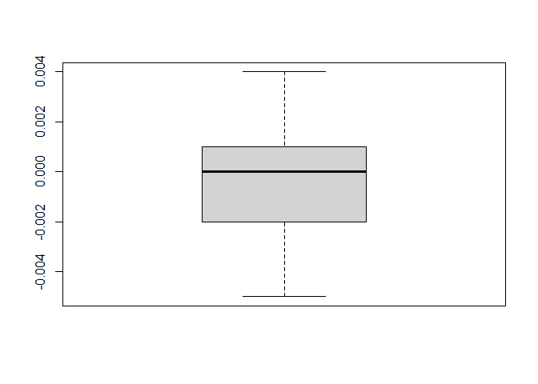<!-- -->

```r
print(aux2,whihd=5)
```

```
## # A tibble: 11,127 x 9
##    Country_Name Country_Code Indicator_Name  Indicator_Code  Year   CO2 Region  
##    <chr>        <chr>        <chr>           <chr>          <dbl> <dbl> <chr>   
##  1 Aruba        ABW          CO2 emissions ~ EN.ATM.CO2E.KT  1960    NA Latin A~
##  2 Aruba        ABW          CO2 emissions ~ EN.ATM.CO2E.KT  1961    NA Latin A~
##  3 Aruba        ABW          CO2 emissions ~ EN.ATM.CO2E.KT  1962    NA Latin A~
##  4 Aruba        ABW          CO2 emissions ~ EN.ATM.CO2E.KT  1963    NA Latin A~
##  5 Aruba        ABW          CO2 emissions ~ EN.ATM.CO2E.KT  1964    NA Latin A~
##  6 Aruba        ABW          CO2 emissions ~ EN.ATM.CO2E.KT  1965    NA Latin A~
##  7 Aruba        ABW          CO2 emissions ~ EN.ATM.CO2E.KT  1966    NA Latin A~
##  8 Aruba        ABW          CO2 emissions ~ EN.ATM.CO2E.KT  1967    NA Latin A~
##  9 Aruba        ABW          CO2 emissions ~ EN.ATM.CO2E.KT  1968    NA Latin A~
## 10 Aruba        ABW          CO2 emissions ~ EN.ATM.CO2E.KT  1969    NA Latin A~
## # ... with 11,117 more rows, and 2 more variables: CO2_kt <dbl>, dif <dbl>
```


```r
data_clean=aux2 %>% inner_join(data_CO2$CO2_Per_Capita_Pivoted) %>% inner_join(data_CO2$Metadata_Countries)
```

```
## Joining, by = c("Country_Name", "Country_Code", "Year")
```

```
## Joining, by = c("Country_Code", "Region")
```
### Preguntas y gráficos


```r
glimpse(data_clean)
```

```
## Rows: 11,127
## Columns: 13
## $ Country_Name               <chr> "Aruba", "Aruba", "Aruba", "Aruba", "Aruba"~
## $ Country_Code               <chr> "ABW", "ABW", "ABW", "ABW", "ABW", "ABW", "~
## $ Indicator_Name             <chr> "CO2 emissions (kt)", "CO2 emissions (kt)",~
## $ Indicator_Code             <chr> "EN.ATM.CO2E.KT", "EN.ATM.CO2E.KT", "EN.ATM~
## $ Year                       <dbl> 1960, 1961, 1962, 1963, 1964, 1965, 1966, 1~
## $ CO2                        <dbl> NA, NA, NA, NA, NA, NA, NA, NA, NA, NA, NA,~
## $ Region                     <chr> "Latin America & Caribbean", "Latin America~
## $ CO2_kt                     <dbl> NA, NA, NA, NA, NA, NA, NA, NA, NA, NA, NA,~
## $ dif                        <dbl> NA, NA, NA, NA, NA, NA, NA, NA, NA, NA, NA,~
## $ CO2_Per_Capita_metric_tons <dbl> NA, NA, NA, NA, NA, NA, NA, NA, NA, NA, NA,~
## $ IncomeGroup                <chr> "High income: nonOECD", "High income: nonOE~
## $ SpecialNotes               <chr> "SNA data for 2000-2011 are updated from of~
## $ TableName                  <chr> "Aruba", "Aruba", "Aruba", "Aruba", "Aruba"~
```


```r
data_clean %>% group_by(Year,Region) %>% summarise(Total_Region=sum(CO2_kt,na.rm=TRUE)) %>% ggplot(aes(x = Year, y = Total_Region)) +   geom_line(aes(color = Region), size = 1)
```

```
## `summarise()` has grouped output by 'Year'. You can override using the `.groups` argument.
```

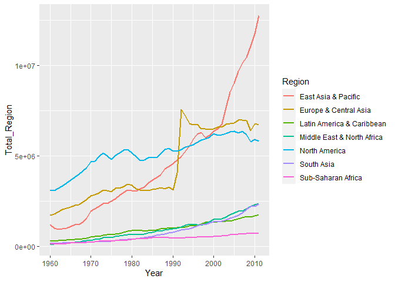<!-- -->


```r
data_clean %>% ggplot(aes(Region,CO2,colour=Year)) + geom_boxplot() + theme(axis.text.x = element_text(angle = 90, hjust = 1)) + geom_jitter(width = 0.2) 
```

```
## Warning: Removed 2095 rows containing non-finite values (stat_boxplot).
```

```
## Warning: Removed 2095 rows containing missing values (geom_point).
```

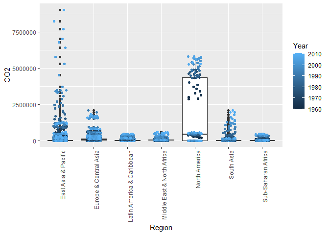<!-- -->

```r
data_clean %>% ggplot(aes(IncomeGroup,CO2_Per_Capita_metric_tons,colour=Year)) + geom_boxplot() + theme(axis.text.x = element_text(angle = 90, hjust = 1)) + geom_jitter(width = 0.2) 
```

```
## Warning: Removed 2098 rows containing non-finite values (stat_boxplot).
```

```
## Warning: Removed 2098 rows containing missing values (geom_point).
```

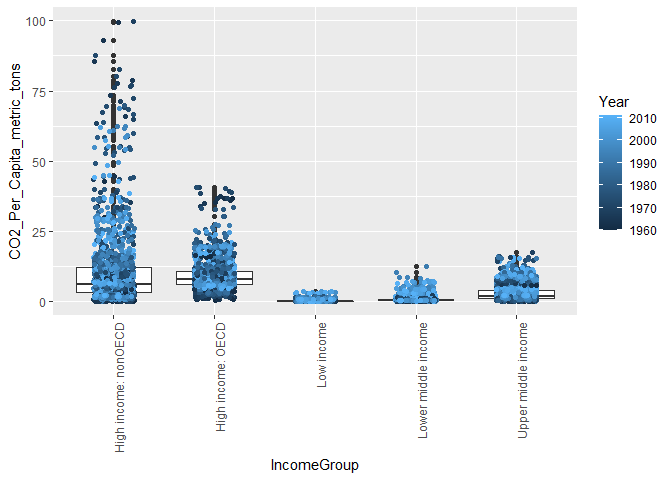<!-- -->


```r
data_clean %>% ggplot(aes(Year,CO2_Per_Capita_metric_tons,colour=Region)) + geom_point(aes(size=CO2) ) + geom_smooth()
```

```
## `geom_smooth()` using method = 'gam' and formula 'y ~ s(x, bs = "cs")'
```

```
## Warning: Removed 2098 rows containing non-finite values (stat_smooth).
```

```
## Warning: Removed 2098 rows containing missing values (geom_point).
```

<!-- -->


```r
WorldData <- map_data('world')
#df <-data.frame(region=c('Hungary','Lithuania','Argentina'),value=c(4,10,11))
color= data_clean %>% group_by(Country_Name) %>% summarise(media=mean(CO2,na.rm=TRUE))
Mydata_plot <- inner_join(WorldData , color,by=c("region"="Country_Name"))
Mydata_plot %>% ggplot() +
  geom_polygon(data=Mydata_plot, aes(x=long, y=lat, group = group,fill=media),colour="black") +
  scale_fill_continuous(low = "thistle2", high = "darkred", guide="colorbar") +
  theme_bw() +
  labs(fill = "legend" ,title = "Title", x="", y="") +
  scale_y_continuous(breaks=c()) +
  scale_x_continuous(breaks=c()) +
  theme(panel.border =  element_blank())+coord_fixed(1)
```

<!-- -->

# Análisis de datos 2021/22: Práctica  del Bloque 1: Datos de emisiones de CO2 en el mundo.

## Modelo de Datos CO2 y fuente de los  datos


El siguiente enlace [WorldBankCO2](https://mkt.tableau.com/Public/Datasets/World_Bank_CO2.xlsx)
nos da acceso a un conocido data set  de [THE WORLD BANK](https://datacatalog.worldbank.org/). En concreto  la versión de este data set es la de de [Tableau Open Data Sets](https://www.tableau.com/learn/articles/free-public-data-sets) una colección de datos del programa [Tableau](https://public.tableau.com/en-us/s/gallery) que es un programa para  representar gráficas, paneles de control o [_dahsboards_](https://en.wikipedia.org/wiki/Dashboard_(business)) y los llamados [KPIs](https://en.wikipedia.org/wiki/Dashboard_(business)). 

### Contexto mundial en emisiones de contaminantes

Los siguientes enlaces sirven para saber el contexto de los datos de emisiones mundiales de CO2 . A partir de podéis buscar más.


* [Protocolo de kioto (wikipedia)](https://es.wikipedia.org/wiki/Protocolo_de_Kioto)
* [Cambio Climático .org](http://www.cambioclimatico.org/tema/protocolo-de-kyoto)
* [Acuerdo de París](https://es.wikipedia.org/wiki/Acuerdo_de_Par%C3%ADs)
* [Acuerdo de París Comisón Europea](https://ec.europa.eu/clima/policies/international/negotiations/paris_es)


## Cuestiones

Redactar un informe que responda las siguientes cuestiones siguiendo las indicaciones de la cuestión 0.

Hay que subir a la actividad correspondiente de la asignatura en Aula Digital el  fichero `.Rmd` y el `.html`.

### Cuestión 0

Tenéis que resolver las siguientes cuestiones editando un informe siguiendo las siguientes instrucciones:

* La salida debe tener índice navegable y las `chunks` deben cachear los datos. 
* El código debe estar bien indentado, con los comentarios necesarios y los nombres de las variables y funciones suficientemente informativos y en un solo idioma. Las funciones  y nombres de variables dentro del texto deben estar en la fuente del código.
* Se debe hacer referencia a la fuente de los datos.
* Cada salida debe tener una conclusión debidamente redactada, sucinta y clara.
* Esta parte se evalúa como presentación  global y vale *2.5 puntos*.

### Cuestión 1

1. Cargar y depurar la tabla de datos.  A partir de las hojas del excel de datos **raw** (`CO2` y `CO2pc`) y de la hoja de metadatos construid  con código de `tidyverse` (`dplyr` y compañía) comprensible y elegante  una tibble que contenga, para cada observación y variable con el tipo de dato adecuado (`numeric`, `character`, `factor`...) y con el nombre que se pone entre paréntesis, las siguientes variables: (*1.25 puntos*)

* El  código de País (`Country_Code`).
* El nombre del País (`Country_Name`).
* El año de la observación (`Year`)
* La observación de CO2 para ese año y país (`CO2`)
* La observación del CO2 por cápita para ese año y país (`CO2pc`).
* Los metadatos de región e ingresos (`Region`, `Income_group`).

2. Mostrad unos resúmenes preliminares de los datos  (sin agrupar, agrupados es la siguiente cuestión) y comentad la estructura y  una descripción detallada de qué significa cada variable y si es necesario de los niveles o de los valores de cada variable (en especial de los metadatos). (*1.25 puntos*)


### Cuestión 2

Se pide:
 
1. Haced algunas estadísticas  de emisiones que muestren las evolución temporal de las emisiones  de `CO2` y `CO2pc` a lo largo de los años y agrupadas para cada variables de metadatos. (*1.25 puntos*)

2. Representar con dos o más  gráficos de ggplot las series temporales de las gráficas anteriores donde se muestre como `x` el `Year` y  como `y` el `CO2` o el `CO2pc` poniendo nombres adecuados y explicativos a los gráficos y  a las leyendas. Representad también las variables de metadatos  o la `y` ausente (cuando es el `CO2` representad el `CO2pc` y viceversa)  (*1.25 puntos*)

### Cuestión 3

En la práctica del Taller del CO2 que se adjunta y se explicó en clase) se representó un mapa con alguna de las informaciones que contiene la tabla por país.

Ese mapa tenía algunos problemas:

 * Con el código de país o el nombre del país de la  tabla de CO2. 
 * De algunos países no se dibujaba su frontera.
 
 Corregid estos errores con el mapa que se dio en el ejemplo o con otros mapas que podáis utilizar con `ggplot2`.
 
 
 Se pide:
 
 1. Construid una tibble *adecuada* que contenga los datos del mapa y los datos de la tabla de `CO2`. (*1 punto*)
 2. Dibujad un mapa por países coloreando  en función de la cantidad  `CO2` o  por la cantidad `CO2pc` (*1 punto*)
 3. Idead y dibujad dos mapas más que incorporen de alguna manera alguno de los metadatos. (*0.5 pt* + *2 puntos extra si los mapas son muy informativos*)


